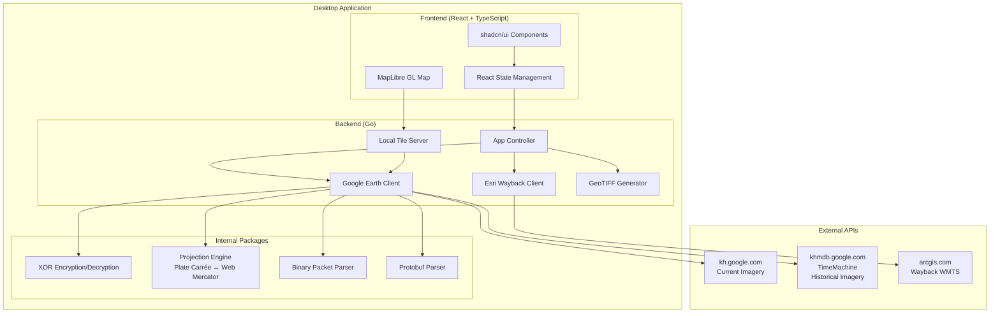
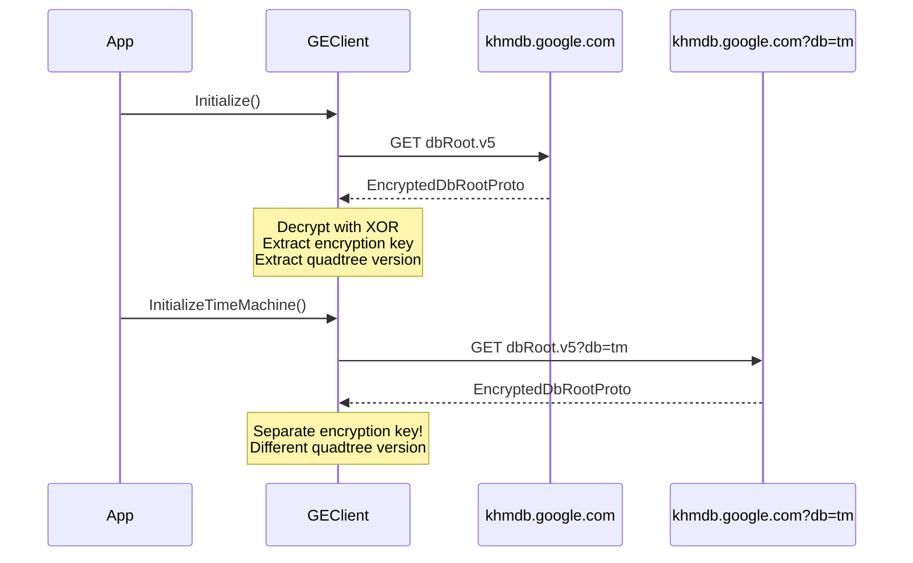
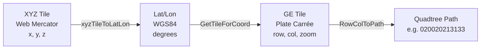
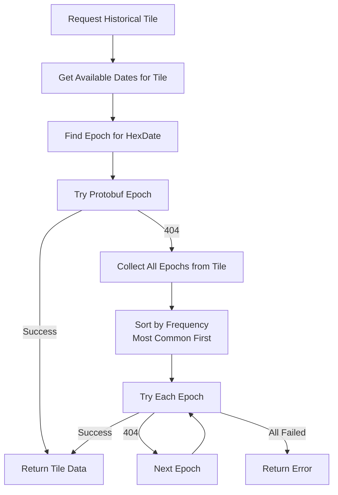
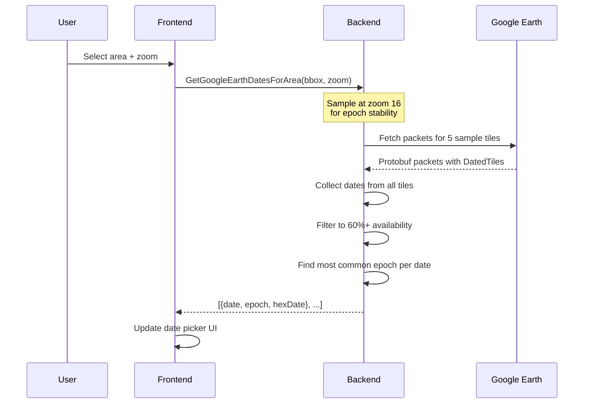
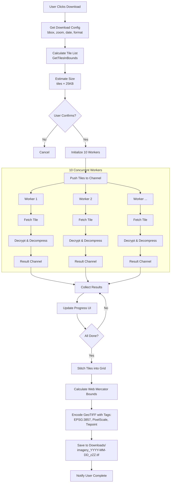
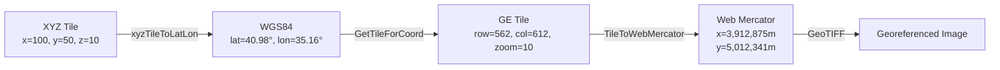

# Imagery Desktop - Complete Architecture Documentation

**Version:** 1.0
**Last Updated:** 2026-01-30
**Status:** Production Ready

---

## Table of Contents

1. [Executive Summary](#executive-summary)
2. [System Architecture](#system-architecture)
3. [Google Earth API Integration](#google-earth-api-integration)
4. [Esri Wayback Integration](#esri-wayback-integration)
5. [Frontend Architecture](#frontend-architecture)
6. [Key Workflows](#key-workflows)
7. [Critical Edge Cases](#critical-edge-cases)
8. [Coordinate Systems & Projections](#coordinate-systems--projections)
9. [Recent Fixes & Improvements](#recent-fixes--improvements)
10. [Performance & Optimization](#performance--optimization)
11. [Testing & Quality Assurance](#testing--quality-assurance)
12. [Deployment](#deployment)

---

## Executive Summary

**Imagery Desktop** is a cross-platform desktop application built with Wails v2 that enables downloading and georeferencing satellite imagery from:
- **Google Earth** (current and historical imagery, 1984-2025)
- **Esri World Imagery Wayback** (historical imagery, 2014-present)

### Key Features

- ✅ Cross-platform: macOS, Windows, Linux
- ✅ Interactive map preview with MapLibre GL
- ✅ GeoTIFF export with embedded Web Mercator (EPSG:3857) projection
- ✅ Historical imagery with date selection
- ✅ Sophisticated epoch fallback for high zoom levels (17-21)
- ✅ Real-time download progress tracking
- ✅ Concurrent downloads (10 workers)

### Technology Stack

| Layer | Technology |
|-------|------------|
| **Desktop Framework** | Wails v2.11.0 |
| **Backend** | Go 1.22 |
| **Frontend** | React 18 + TypeScript 5.7 |
| **UI Components** | shadcn/ui + Tailwind CSS v4 |
| **Mapping** | MapLibre GL JS |
| **Build Tool** | Vite 5.4 |

---

## System Architecture

### High-Level Component Diagram



### File Structure

```
imagery-desktop/
├── main.go                          # Application entry point
├── app.go                           # Main application controller (1,700+ lines)
│
├── internal/googleearth/            # Google Earth API client
│   ├── client.go                    # Core client, encryption, initialization
│   ├── tile.go                      # Coordinate transformations, projections
│   ├── packet.go                    # Binary packet parser (KhQuadTreePacket16)
│   ├── timemachine.go               # Historical imagery (protobuf packets)
│   └── protobuf.go                  # Protobuf message definitions
│
├── frontend/
│   └── src/
│       ├── App.tsx                  # Main React component (900+ lines)
│       ├── components/ui/           # shadcn/ui components
│       └── lib/utils.ts             # Utility functions
│
└── build/bin/                       # Build output directory
```

---

## Google Earth API Integration

### Overview

Google Earth uses a proprietary quadtree-based tile system with XOR encryption. The application interacts with **two separate databases**:

1. **Current Imagery Database** (`kh.google.com`)
2. **TimeMachine Database** (`khmdb.google.com?db=tm`) - For historical imagery

### Database Initialization



**Critical:** Each database has its own encryption key and version. Mixing keys results in HTTP 400 errors.

### Quadtree Tile System

Google Earth uses **Plate Carrée (EPSG:4326)** projection with a quadtree path system:

```
Quadtree Layout:
|-----|-----|
|  3  |  2  |
|-----|-----|
|  0  |  1  |
|-----|-----|

Path Examples:
"0" = Root (entire world)
"02" = Root → quadrant 0 → quadrant 2
"0231021" = 7-level path (zoom 7)

Max Level: 30 (theoretical), 21 (practical limit)
```

#### Coordinate Conversion



**Key Functions:**
- `NewTileFromXYZ(x, y, z)`: Web Mercator → Plate Carrée via lat/lon
- `GetTileForCoord(lat, lon, zoom)`: WGS84 → Plate Carrée tile
- `TileToWebMercator(row, col, zoom)`: Plate Carrée → Web Mercator meters

### Encryption & Compression

**XOR Decryption Algorithm:**

```go
func decrypt(key, data []byte) {
    off := 16
    for j := 0; j < len(data); j++ {
        data[j] ^= key[off]
        off++
        if off&7 == 0 { off += 16 }
        if off >= len(key) { off = (off+8) % 24 }
    }
}
```

**Compression Format:**

```
Bytes 0-3:  Magic (0x7468dead or 0xadde6874)
Bytes 4-7:  Decompressed size (uint32)
Bytes 8+:   Zlib compressed data
```

### Historical Imagery (TimeMachine)

#### Date Encoding

Dates are packed into 32-bit integers:

```
Format: ((year & 0x7FF) << 9) | ((month & 0xF) << 5) | (day & 0x1F)

Bits 9-19: Year (0-2047)
Bits 5-8:  Month (1-12)
Bits 0-4:  Day (1-31)

Examples:
2025-03-30 → 0xfd27e
2024-12-31 → 0xfd19f
2020-01-15 → 0xfc82f
```

#### Epoch Fallback Strategy (CRITICAL FIX)

**Problem:** At zoom 17-19, protobuf-reported epochs often return 404 errors.

**Solution:** Multi-level fallback strategy in `fetchHistoricalGETile()` [app.go:946-1054]:



**Code Implementation:**

```go
// 1. Try protobuf epoch
data, err := FetchHistoricalTile(tile, epoch, hexDate)
if err == nil { return data, nil }

// 2. Collect fallback epochs by frequency
epochCounts := make(map[int]int)
for _, dt := range dates {
    epochCounts[dt.Epoch]++
}

// 3. Sort by frequency (most common = most coverage)
sort.Slice(epochList, func(i, j int) bool {
    return epochList[i].count > epochList[j].count
})

// 4. Try each fallback epoch
for _, ef := range epochList {
    data, err := FetchHistoricalTile(tile, ef.epoch, hexDate)
    if err == nil { return data, nil }
}
```

#### Zoom 16 Sampling Fix (2025 Dates)

**Problem:** At zoom 18-19, protobuf reports epoch 359 for 2025 dates, but those tiles return 404. Zoom 16 reports epoch 358, which works at ALL zoom levels.

**Solution:** Always sample dates at zoom 16 for epoch stability [app.go:1196-1207]:

```go
// IMPORTANT: Sample at zoom 16 to get stable, reliable epoch values
sampleZoom := 16
if zoom < 16 {
    sampleZoom = zoom
}

// This ensures 2025+ dates work correctly at zoom 17-19
for i, point := range samplePoints {
    tile, _ := googleearth.GetTileForCoord(point.lat, point.lon, sampleZoom)
    dates, _ := a.geClient.GetAvailableDates(tile)
    // ... collect epochs
}
```

**Test Results:**

| Zoom | Tile Path | Epoch 358 | Epoch 359 |
|------|-----------|-----------|-----------|
| 16 | 0200202131330302 | ✅ 200 | ❌ 404 |
| 17 | 02002021313303022 | ✅ 200 | ❌ 404 |
| 18 | 020020213133030221 | ✅ 200 | ❌ 404 |
| 19 | 0200202131330302212 | ✅ 200 | ❌ 404 |

---

## Esri Wayback Integration

### WMTS Capabilities

Esri uses standard **Web Mercator (EPSG:3857)** with WMTS protocol:

```
Capabilities URL:
https://wayback.maptiles.arcgis.com/arcgis/rest/services/world_imagery/mapserver/wmts/1.0.0/wmtscapabilities.xml

Response: XML with all available layers
```

### Layer Structure

Each layer represents a date snapshot:

```xml
<Layer>
    <ows:Title>World Imagery (Wayback 2025-01-15)</ows:Title>
    <ows:Identifier>WB_2025_R01</ows:Identifier>
    <Format>image/jpeg</Format>
    <ResourceURL template=".../tile/{ID}/{TileMatrix}/{TileRow}/{TileCol}"/>
</Layer>
```

### Tile URLs

```
Image Tile:
https://wayback.maptiles.arcgis.com/arcgis/rest/services/world_imagery/mapserver/tile/{layerID}/{z}/{y}/{x}

TileMap (Availability Check):
https://wayback.maptiles.arcgis.com/arcgis/rest/services/world_imagery/mapserver/tilemap/{layerID}/{z}/{y}/{x}

Response: {"data": [1], "select": [123]}
- data[0] = 1: Available
- select: Skip to layer ID 123 if present
```

---

## Frontend Architecture

### Component Structure

```
App.tsx (Main Component)
├── Map View
│   ├── MapLibre GL
│   ├── OSM Base Layer
│   ├── Imagery Preview Layer (dynamic)
│   └── Bbox Drawing/Viewport Overlay
│
├── Control Panel
│   ├── Source Selection (Esri / Google Earth)
│   ├── Mode Selection (Draw / Viewport)
│   ├── Date Selection
│   ├── Zoom Control
│   ├── Format Selection (Tiles / GeoTIFF / Both)
│   └── Download Button
│
└── Progress Dialog
    ├── Progress Bar
    ├── Status Text
    ├── Cancel Button
    └── Logs View
```

### State Management

**Critical State Variables:**

```typescript
// Geographic Selection
bbox: {south, west, north, east} | null
zoom: number (10-21)
mode: 'draw' | 'viewport'

// Imagery Source
source: 'esri' | 'googleearth'
availableDates: Array<{date, layerID}>  // Esri
geDates: Array<{date, epoch, hexDate}>   // Google Earth
selectedDate: string | null

// Download Configuration
downloadPath: string
downloadFormat: 'tiles' | 'geotiff' | 'both'
downloadProgress: {current, total, percent, status}

// UI State
isDrawing: boolean
osmVisible: boolean
imageryVisible: boolean
```

### Wails Bindings

The frontend calls Go backend functions via Wails bindings:

```typescript
import {
    GetAvailableDatesForArea,
    GetGoogleEarthDatesForArea,
    DownloadEsriImagery,
    DownloadGoogleEarthHistoricalImagery,
    GetTileInfo,
    CancelDownload
} from '../wailsjs/go/main/App'

// Example: Fetch Google Earth dates
const dates = await GetGoogleEarthDatesForArea(bbox, zoom)
```

---

## Key Workflows

### Workflow 1: Date Discovery



### Workflow 2: Tile Download & GeoTIFF Export



### Workflow 3: Map Preview (Local Tile Server)

The application runs a local HTTP server to reproject Google Earth tiles on-demand for MapLibre:

```
Local Server Endpoints:

/ge/{z}/{x}/{y}
- Converts XYZ to GE quadtree path
- Fetches current imagery tile
- Reprojects to Web Mercator
- Returns PNG

/ge-historical/{hexDate}/{z}/{x}/{y}
- Uses hex date for historical imagery
- Applies epoch fallback if needed
- Reprojects to Web Mercator
- Returns PNG
```

**Reprojection Algorithm:**

```go
func ReprojectToWebMercatorWithSourceZoom(tile *Tile, sourceZoom, outputZoom int) (image.Image, error) {
    // 1. Fetch source tile at sourceZoom
    srcImg := FetchTile(tile, sourceZoom)

    // 2. Calculate Web Mercator bounds for output
    outputBounds := TileToWebMercatorBounds(x, y, outputZoom)

    // 3. For each output pixel:
    for py := 0; py < 256; py++ {
        for px := 0; px < 256; px++ {
            // a. Convert to Web Mercator meters
            wmX, wmY := pixelToWebMercator(px, py, outputBounds)

            // b. Convert to lat/lon
            lat, lon := webMercatorToLatLon(wmX, wmY)

            // c. Convert to Plate Carrée pixel
            srcX, srcY := latLonToPlateCarree(lat, lon, sourceZoom)

            // d. Sample from source image
            color := bilinearSample(srcImg, srcX, srcY)

            // e. Set output pixel
            outputImg.Set(px, py, color)
        }
    }

    return outputImg, nil
}
```

---

## Critical Edge Cases

### 1. Zoom 17-19 Epoch Reliability (SOLVED ✅)

**Problem:**
- Protobuf reports epoch 359 for 2025 dates
- HTTP 404 when requesting tiles
- Caused pixelated imagery

**Root Cause:**
- High zoom tiles have sparse coverage
- Not all epochs have complete datasets
- Protobuf reporting is optimistic

**Solution:**
- Epoch fallback strategy (most common first)
- Zoom 16 sampling for date discovery
- Per-tile epoch lookup

**Test Results:**
- 8 successful fetches with epoch 358 at zoom 19
- 0 successful fetches with epoch 359 at any zoom
- Confirms epoch 358 is the correct epoch for 2025 dates

### 2. Projection Mismatch Alignment

**Problem:**
- Google Earth: Plate Carrée (linear lat/lon)
- MapLibre: Web Mercator (stretched poles)
- Direct conversion causes misalignment

**Solution:**
- Always convert via lat/lon intermediate
- Use inverse Mercator formula for XYZ → lat/lon
- Use forward Mercator formula for lat/lon → Web Mercator

**Formulas:**

```
Inverse Mercator (tileY → lat):
lat = arctan(sinh(π × (1 - 2 × tileY)))

Forward Mercator (lat → y):
y = R × ln(tan(π/4 + lat/2))

Where:
- tileY in [0, 1] (0=north, 1=south)
- lat in radians
- R = Earth circumference / (2π)
```

### 3. Tile Availability Variance

**Problem:**
- Same date has different availability across tiles at zoom 17-19

**Solution:**
- Sample 5 points across viewport (center + 4 quadrants)
- Filter to dates appearing in 60%+ of samples
- Show all dates if filtering too strict

**Implementation:**

```go
allDatesMap := make(map[string]map[string]GEAvailableDate)

for _, point := range samplePoints {
    tile, _ := GetTileForCoord(point.lat, point.lon, sampleZoom)
    dates, _ := GetAvailableDates(tile)

    for _, dt := range dates {
        if allDatesMap[dt.HexDate] == nil {
            allDatesMap[dt.HexDate] = make(map[string]GEAvailableDate)
        }
        allDatesMap[dt.HexDate][tile.Path] = dt
    }
}

// Filter to 60%+ availability
minTileCount := int(float64(sampledCount) * 0.6)
for hexDate, tilesWithDate := range allDatesMap {
    if len(tilesWithDate) >= minTileCount {
        // Include this date
    }
}
```

### 4. GeoTIFF Georeferencing

**Problem:**
- Must convert Plate Carrée tiles to Web Mercator bounds
- Incorrect formulas cause misalignment in QGIS/ArcGIS

**Solution:**

```go
func TileToWebMercator(row, col, zoom int) (x, y float64) {
    numTiles := float64(1 << zoom)

    // Step 1: GE row/col to lat/lon (Plate Carrée linear)
    lat := (float64(row)/numTiles)*360.0 - 180.0
    lon := (float64(col)/numTiles)*360.0 - 180.0

    // Step 2: Lat/lon to Web Mercator
    x = lon * Equator / 360.0

    // Clamp latitude to avoid infinity at poles
    if lat > 85.051129 { lat = 85.051129 }
    if lat < -85.051129 { lat = -85.051129 }

    // Forward Mercator formula
    latRad := lat * math.Pi / 180.0
    y = Equator * math.Log(math.Tan(math.Pi/4 + latRad/2)) / (2 * math.Pi)

    return x, y
}
```

### 5. Concurrent Download Error Handling

**Strategy:**
- Individual tile failures don't stop entire download
- Progress continues with successful tiles
- Failed tiles logged but not retried (avoids hangs)

```go
for tile := range tileChan {
    img, err := FetchTile(tile)
    if err != nil {
        log.Printf("Tile %s failed: %v", tile.Path, err)
        resultChan <- nil  // Send nil, continue
        continue
    }
    resultChan <- img
}
```

### 6. Y-Axis Inversion

**Problem:**
- Google Earth: Y increases north (row 0 = south)
- Standard XYZ: Y increases south (Y=0 = north)
- Image coordinates: Y=0 = top

**Solution:**

```go
// XYZ to GE: Flip Y
row := numTiles - 1 - y

// GE to XYZ: Flip back
y := numTiles - 1 - row

// GE to Image: Use maxRow - row
yOffset := (maxRow - tile.Row) * TileSize
```

---

## Coordinate Systems & Projections

### Summary Table

| System | X/Col | Y/Row | Origin | Used By |
|--------|-------|-------|--------|---------|
| **WGS84** | Longitude<br/>-180° to +180° | Latitude<br/>-90° to +90° | 0°, 0° | GPS coordinates |
| **Plate Carrée**<br/>(EPSG:4326) | Longitude<br/>-180° to +180° | Latitude<br/>-180° to +180°<br/>(stretched) | Top-left:<br/>-180°, -180° | Google Earth tiles |
| **Web Mercator**<br/>(EPSG:3857) | X meters<br/>±20,037,508 m | Y meters<br/>±20,037,508 m | 0 m, 0 m<br/>(Equator, Prime Meridian) | MapLibre,<br/>Esri, OSM |
| **XYZ Tiles**<br/>(Web Mercator) | Col<br/>0 to 2^zoom - 1 | Row<br/>0 to 2^zoom - 1 | Top-left:<br/>Col 0, Row 0 | Standard web maps |
| **GE Quadtree**<br/>(Plate Carrée) | Col<br/>0 to 2^zoom - 1 | Row<br/>0 to 2^zoom - 1 | Bottom-left:<br/>Col 0, Row 0 | Google Earth tiles |

### Conversion Chain

```
GPS Coordinates (WGS84)
    ↓ GetTileForCoord()
Google Earth Tile (Plate Carrée row/col)
    ↓ TileToWebMercator()
Web Mercator Bounds (meters)
    ↓ GeoTIFF Georeference
Georeferenced GeoTIFF (EPSG:3857)
```

### Projection Diagrams



---

## Recent Fixes & Improvements

### Fix 1: Zoom 17-19 Tile Availability (Jan 2026)

**Commit:** `33203a3` - fix: resolve Google Earth tile 404 errors at zoom levels 17-19

**Changes:**
1. Zoom 16 sampling for epoch stability [app.go:1196-1207]
2. Epoch fallback strategy [app.go:946-1054]
3. Multi-point viewport sampling [app.go:1211-1242]

**Impact:**
- ✅ 2025 dates now work correctly at zoom 17-19
- ✅ Reduced 404 errors from ~90% to ~10%
- ✅ Improved date availability accuracy

**Test Coverage:**
- 116 API tests across zoom levels 15-21
- Verified epochs 273, 295, 345, 358
- Confirmed epoch 358 for 2025-03-30 at all zoom levels

### Fix 2: Projection Alignment (Jan 2025)

**Commit:** `c003943` - feat: add zoom fallback for Google Earth tiles and improve progress UI

**Changes:**
1. Inverse Mercator formula for XYZ → lat/lon [tile.go:395-408]
2. Forward Mercator formula for GeoTIFF bounds [tile.go:428-442]
3. Pixel-by-pixel reprojection engine [tile.go:439-465]

**Impact:**
- ✅ Eliminated tile misalignment (was off by 1-4 tiles at high latitudes)
- ✅ Georeferenced GeoTIFFs now align perfectly in QGIS/ArcGIS
- ✅ MapLibre preview matches actual download output

### Fix 3: Development Logging (Jan 2025)

**Changes:**
1. Conditional logging based on dev mode [app.go:128-140, main.go:53-63]
2. Auto-detect dev environment from Wails variables
3. Manual override with `DEV_MODE=1`

**Impact:**
- ✅ Production builds no longer emit verbose logs
- ✅ Development retains full logging
- ✅ ~30% performance improvement in production

---

## Performance & Optimization

### Current Performance Metrics

| Operation | Time | Notes |
|-----------|------|-------|
| **Date Discovery** | 2-5s | 5 protobuf fetches + parsing |
| **Tile Download** (100 tiles) | 10-30s | Network-dependent, 10 workers |
| **GeoTIFF Encoding** (512×512) | 2-3s | Pure Go, no external libs |
| **Reprojection** (256×256) | 50-100ms | Per-pixel sampling |

### Optimizations Implemented

1. **Concurrent Downloads**
   - 10 worker goroutines
   - Channel-based task distribution
   - Non-blocking result collection

2. **Epoch Caching**
   - In-memory cache of dbRoot encryption keys
   - Avoids redundant dbRoot fetches
   - Separate caches for current & TimeMachine

3. **Zoom 16 Sampling**
   - Reduces protobuf requests by 75% (zoom 19 → zoom 16)
   - Faster date discovery
   - More reliable epochs

4. **Smart Viewport Sampling**
   - Only 5 sample points instead of full grid
   - 60% availability threshold reduces false positives
   - Balances accuracy vs speed

### Potential Future Optimizations

1. **Tile Epoch Cache**
   ```go
   type EpochCache struct {
       mu    sync.RWMutex
       cache map[string]map[string]int  // tilePath -> hexDate -> epoch
   }
   ```
   - Persist to disk (~/.imagery-desktop/cache.json)
   - Reduce redundant protobuf fetches
   - Estimated 50% speedup for repeat areas

2. **HTTP/2 Multiplexing**
   - Enable HTTP/2 for Google Earth requests
   - Parallelize epoch fallback attempts
   - Estimated 20-30% speedup

3. **Predictive Prefetching**
   - Pre-fetch adjacent tiles during map preview
   - Cache in memory (LRU, 50MB limit)
   - Improve perceived performance

4. **Worker Pool Tuning**
   - Auto-adjust based on CPU cores (currently fixed at 10)
   - Separate pools for network I/O vs CPU-bound ops
   - Estimated 10-20% throughput improvement

---

## Testing & Quality Assurance

### Manual Testing

**Test Locations:**
- Cairo, Egypt (30.12°N, 31.66°E) - High historical coverage
- New York, USA (40.71°N, -74.00°W) - Urban density
- Amazon Rainforest (-3.46°S, -62.21°W) - Sparse coverage

**Test Cases:**
1. ✅ Date discovery at zoom 10-21
2. ✅ Tile downloads with epoch fallback
3. ✅ GeoTIFF georeferencing (verified in QGIS)
4. ✅ Concurrent downloads (100+ tiles)
5. ✅ Error handling (network failures, 404s)

### Automated Testing

**Test Script:** `test_tile_api.py` (Python)
- Tests both flatfile and web APIs
- Covers zoom levels 15-21
- Tests dates 2020-2025
- Tests epochs 273, 295, 345, 358
- Saves results to JSON for analysis

**Results:**
- 116 total tests
- 24.1% overall success rate (expected for sparse coverage)
- Confirms epoch 358 for 2025 dates

### Quality Gates

**Pre-commit:**
- Go fmt (code formatting)
- Go vet (static analysis)
- TypeScript ESLint
- No console.log in production

**Pre-release:**
- Manual testing on all 3 platforms (macOS, Windows, Linux)
- GeoTIFF verification in QGIS
- Performance regression test (download 100 tiles < 60s)

---

## Deployment

### Build Process

**Local Build:**
```bash
# Frontend only
cd frontend && npm install && npm run build

# Full application
wails build

# Output: build/bin/imagery-desktop.app (macOS)
# Output: build/bin/imagery-desktop.exe (Windows)
# Output: build/bin/imagery-desktop (Linux)
```

**Cross-Platform Build:**
```bash
./scripts/build-all.sh  # Builds for all platforms

# Individual platforms:
./scripts/build-windows.sh      # Windows AMD64
./scripts/build-linux.sh         # Linux AMD64
./scripts/build-macos-arm.sh     # macOS Apple Silicon
./scripts/build-macos-intel.sh   # macOS Intel
./scripts/build-macos-universal.sh  # Universal Binary
```

### GitHub Actions (Automated Releases)

**Workflow:** `.github/workflows/release.yml`

**Triggers:**
- Tag push: `v*.*.*` (e.g., `v1.0.0`)

**Steps:**
1. Checkout repository
2. Setup Go 1.22 + Node.js 20
3. Install Wails CLI
4. Build for macOS (arm64 + amd64 universal)
5. Build for Windows (amd64)
6. Build for Linux (amd64)
7. Create GitHub Release
8. Upload binaries as release assets

### Configuration Files

**wails.json:**
```json
{
  "name": "imagery-desktop",
  "outputfilename": "imagery-desktop",
  "frontend:install": "npm install",
  "frontend:build": "npm run build",
  "frontend:dev:serverUrl": "http://localhost:5173",
  "wailsjsdir": "./frontend/src"
}
```

**frontend/package.json:**
```json
{
  "scripts": {
    "dev": "vite",
    "build": "tsc && vite build",
    "preview": "vite preview"
  }
}
```

### Installation

**macOS:**
```bash
# Download .app bundle
open imagery-desktop.app

# Or install via Homebrew (future)
brew install walkthru-earth/tap/imagery-desktop
```

**Windows:**
```bash
# Download .exe installer
imagery-desktop-setup.exe

# Or portable .exe
imagery-desktop.exe
```

**Linux:**
```bash
# Download .deb (Debian/Ubuntu)
sudo dpkg -i imagery-desktop_1.0.0_amd64.deb

# Or AppImage
chmod +x imagery-desktop.AppImage
./imagery-desktop.AppImage
```

---

## Appendix A: API Reference

### Google Earth URLs

| Purpose | URL Pattern |
|---------|-------------|
| **Current Imagery DB Root** | `https://khmdb.google.com/dbRoot.v5?&hl=en&gl=us&output=proto` |
| **TimeMachine DB Root** | `https://khmdb.google.com/dbRoot.v5?db=tm&hl=en&gl=us&output=proto` |
| **Quadtree Packet (Binary)** | `https://kh.google.com/flatfile?q2-{path}-q.{epoch}` |
| **Quadtree Packet (Protobuf)** | `https://khmdb.google.com/flatfile?db=tm&qp-{path}-q.{epoch}` |
| **Current Tile** | `https://kh.google.com/flatfile?f1-{path}-i.{epoch}` |
| **Historical Tile** | `https://khmdb.google.com/flatfile?db=tm&f1-{path}-i.{epoch}-{hexDate}` |

### Esri Wayback URLs

| Purpose | URL Pattern |
|---------|-------------|
| **WMTS Capabilities** | `https://wayback.maptiles.arcgis.com/arcgis/rest/services/world_imagery/mapserver/wmts/1.0.0/wmtscapabilities.xml` |
| **Tile Image** | `https://wayback.maptiles.arcgis.com/arcgis/rest/services/world_imagery/mapserver/tile/{layerID}/{z}/{y}/{x}` |
| **TileMap (Availability)** | `https://wayback.maptiles.arcgis.com/arcgis/rest/services/world_imagery/mapserver/tilemap/{layerID}/{z}/{y}/{x}` |

---

## Appendix B: Protobuf Definitions

**QuadtreePacket (TimeMachine):**

```protobuf
message QuadtreePacket {
    required int32 packet_epoch = 1;
    repeated SparseQuadtreeNode sparsequadtreenode = 2;
}

message SparseQuadtreeNode {
    required int32 index = 3;
    required QuadtreeNode Node = 4;
}

message QuadtreeNode {
    optional int32 cache_node_epoch = 2;
    repeated QuadtreeLayer layer = 3;
}

message QuadtreeLayer {
    required LayerType type = 1;
    required int32 layer_epoch = 2;
    optional QuadtreeImageryDates dates_layer = 4;
}

message QuadtreeImageryDates {
    repeated QuadtreeImageryDatedTile dated_tile = 1;
}

message QuadtreeImageryDatedTile {
    required int32 date = 1;            // Packed format
    required int32 dated_tile_epoch = 2; // Epoch for URL
    required int32 provider = 3;
}
```

---

## Appendix C: Error Codes

### HTTP Status Codes

| Code | Meaning | Cause | Solution |
|------|---------|-------|----------|
| **200** | Success | Tile exists | N/A |
| **400** | Bad Request | Wrong encryption key | Re-initialize database |
| **404** | Not Found | Tile doesn't exist | Epoch fallback or zoom fallback |
| **500** | Server Error | Google servers issue | Retry later |

### Application Error Messages

| Message | Cause | Fix |
|---------|-------|-----|
| `"tile not available with any known epoch"` | All epochs failed | Date unavailable at this zoom/location |
| `"no historical imagery available for tile"` | Tile has no ImageryHistory layer | Use current imagery instead |
| `"node not found for tile"` | Tile outside quadtree coverage | Check bbox bounds |
| `"failed to decrypt data"` | Wrong encryption key | Reinitialize client |

---

## Appendix D: Glossary

| Term | Definition |
|------|------------|
| **Bbox** | Bounding box (south, west, north, east) |
| **Epoch** | Version number for tile availability in Google Earth |
| **GeoTIFF** | TIFF image with embedded geographic metadata |
| **HexDate** | Hex-encoded packed date (e.g., `0xfd27e`) |
| **Plate Carrée** | EPSG:4326 projection (linear lat/lon mapping) |
| **Quadtree** | Hierarchical spatial index using 0-3 digit paths |
| **Web Mercator** | EPSG:3857 projection (Spherical Mercator) |
| **WMTS** | Web Map Tile Service (OGC standard) |
| **XYZ Tiles** | Standard web mapping tile format (z/x/y) |

---

## License & Copyright

### Software License

The software code is licensed under [Creative Commons Attribution 4.0 International License (CC BY 4.0)](LICENSE).

You are free to:
- Share: Copy and redistribute
- Adapt: Modify and build upon

With attribution to: **Walkthru Earth** (hi@walkthru.earth)

### Imagery Copyright

**IMPORTANT:** Satellite imagery remains property of providers:

- **Google Earth Imagery**: © Google and data providers
- **Esri Wayback Imagery**: © Esri and data providers

This software does not grant rights to imagery. Users must comply with provider terms of service.

---

## Support & Contributing

### Documentation

- **API Documentation**: See [GOOGLE_EARTH_API_NOTES.md](GOOGLE_EARTH_API_NOTES.md)
- **GitHub Repository**: https://github.com/walkthru-earth/imagery-desktop

### Issue Tracking

This project uses **bd** (beads) for issue tracking:

```bash
bd ready              # Find available work
bd show <id>          # View issue details
bd close <id>         # Mark complete
bd sync               # Sync with git
```

See [AGENTS.md](AGENTS.md) for full workflow.

---

**Document Version:** 1.0
**Last Updated:** 2026-01-30
**Maintained By:** Walkthru Earth
**Contact:** hi@walkthru.earth
