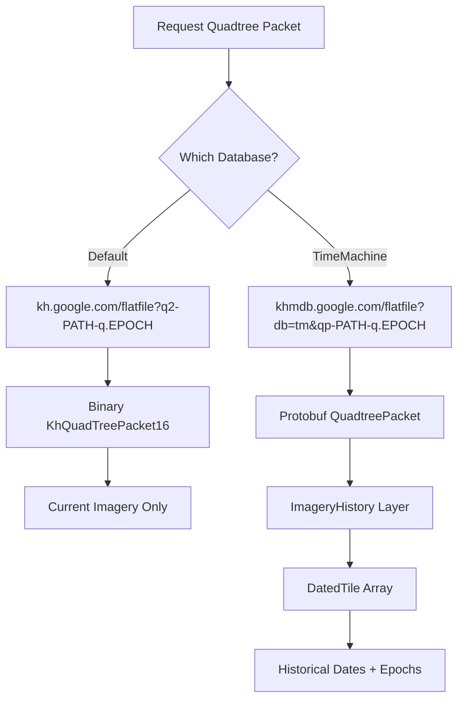
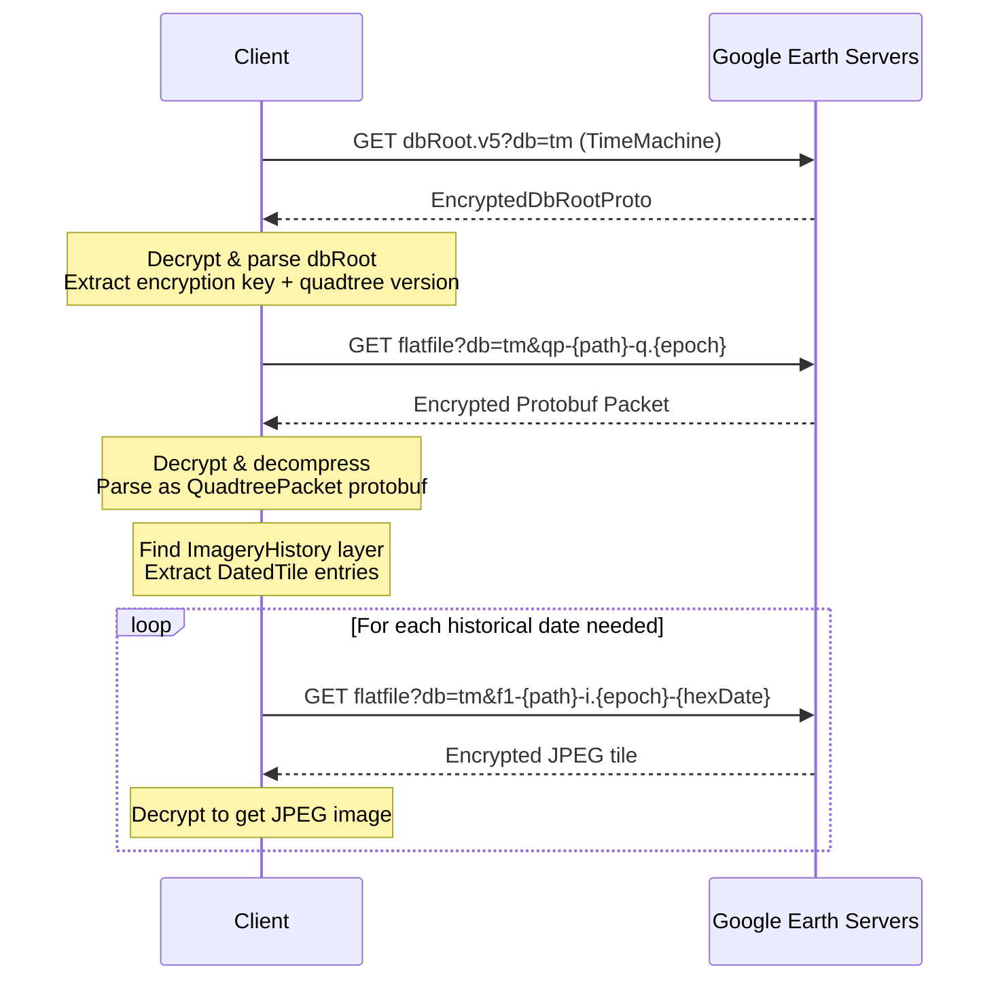
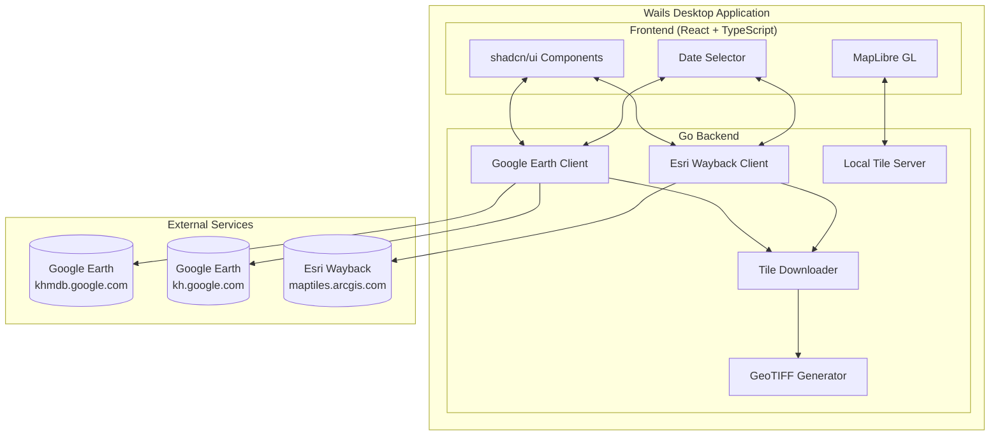
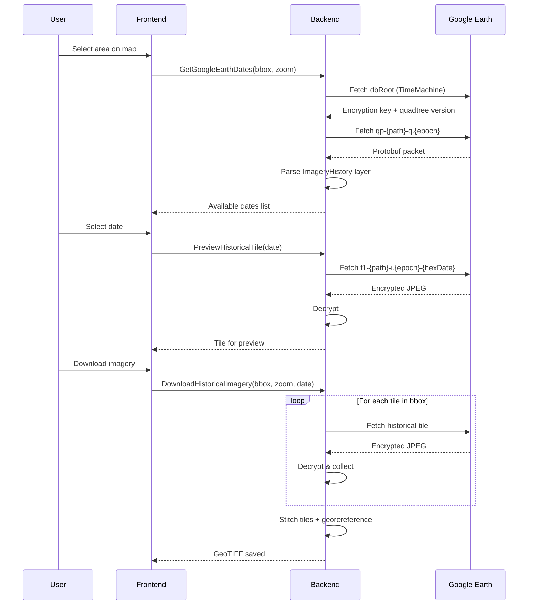
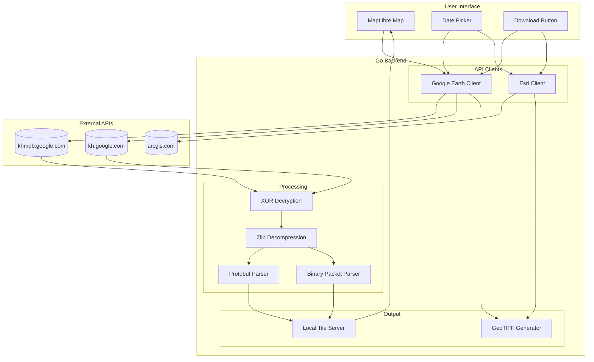
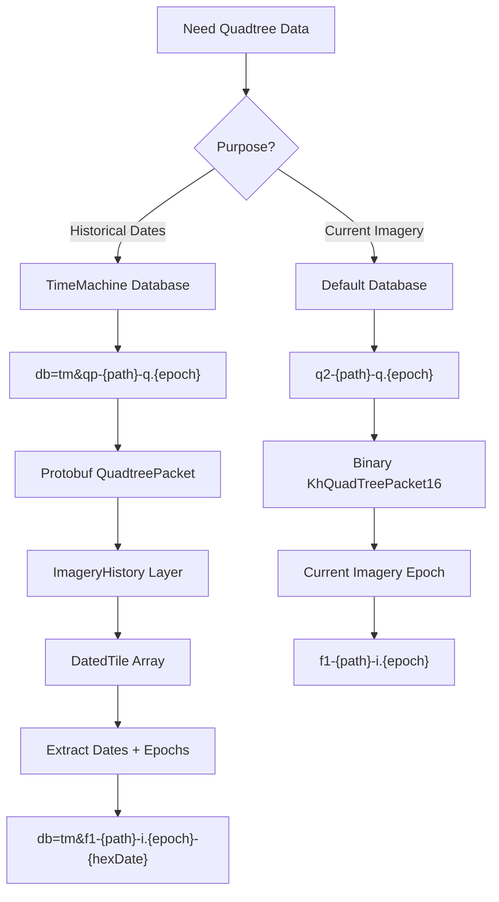

# Google Earth Pro & Esri Wayback Imagery API Documentation

This document contains technical notes and API details for downloading historical satellite imagery from Google Earth Pro and Esri World Imagery Wayback.

---

## Table of Contents

1. [Google Earth Pro API](#google-earth-pro-api)
   - [Database Root](#database-root)
   - [Tile Coordinate System](#tile-coordinate-system)
   - [Two Packet Formats](#two-packet-formats)
   - [Tile URLs](#tile-urls)
   - [Encryption & Compression](#encryption--compression)
   - [Date Encoding Format](#date-encoding-format)
   - [Getting Available Dates](#getting-available-dates)
   - [Required Headers](#required-headers)
2. [Esri World Imagery Wayback API](#esri-world-imagery-wayback-api)
   - [WMTS Capabilities](#wmts-capabilities)
   - [Layer Structure](#layer-structure)
   - [Tile URLs](#esri-tile-urls)
   - [Date Availability](#date-availability)
3. [Implementation Architecture](#implementation-architecture)
4. [Data Flow Diagrams](#data-flow-diagrams)
5. [Sources & References](#sources--references)

---

## Google Earth Pro API

### Database Root

The Google Earth database root contains encryption keys and quadtree version information.

**Default Database URL:**
```
https://khmdb.google.com/dbRoot.v5?&hl=en&gl=us&output=proto
```

**TimeMachine Database URL (for historical imagery):**
```
https://khmdb.google.com/dbRoot.v5?db=tm&hl=en&gl=us&output=proto
```

**Response:** Encrypted protobuf (`EncryptedDbRootProto`) containing:
- `encryption_data` (field 2): The XOR encryption key (1016 bytes typically)
- `dbrootData` (field 3): Compressed and encrypted `DbRootProto`

The `DbRootProto` contains:
- `database_version.quadtree_version` (field 13.1): Version number used in tile requests

### Tile Coordinate System

Google Earth uses a **quadtree path string** system instead of standard XYZ tiles.

#### Quadtree Layout
```
|-----|-----|
|  3  |  2  |
|-----|-----|
|  0  |  1  |
|-----|-----|
```

- Root node path: `"0"`
- Each level adds a digit (0-3) representing the quadrant
- Example: `"0231021"` = root → quadrant 2 → quadrant 3 → quadrant 1 → ...
- Maximum level: 30
- **Y-axis is bottom-up** (opposite of standard XYZ where Y is top-down)

#### Converting XYZ to Quadtree Path

```go
func xyzToQuadtreePath(x, y, z int) string {
    // Convert Y from top-down (XYZ) to bottom-up (Keyhole)
    numTiles := 1 << z
    row := numTiles - 1 - y
    col := x

    path := "0"
    for i := z - 1; i >= 0; i-- {
        rowBit := (row >> i) & 1
        colBit := (col >> i) & 1
        quad := (rowBit << 1) | (rowBit ^ colBit)
        path += string('0' + quad)
    }
    return path
}
```

```javascript
function xyzToQuadtreePath(x, y, z) {
    const numTiles = 1 << z;
    const row = numTiles - 1 - y; // Flip Y axis
    const col = x;

    let path = '0';
    for (let i = z - 1; i >= 0; i--) {
        const rowBit = (row >> i) & 1;
        const colBit = (col >> i) & 1;
        const quad = (rowBit << 1) | (rowBit ^ colBit);
        path += quad;
    }
    return path;
}
```

### Two Packet Formats

**CRITICAL:** Google Earth uses TWO different quadtree packet formats:

#### 1. Binary Format (KhQuadTreePacket16)
- Used by: Default database (`kh.google.com`)
- URL prefix: `q2-` (e.g., `q2-0231-q.1031`)
- Magic ID: `32301` (0x7E2D)
- Contains: Current imagery epochs, terrain, basic layer info
- **Does NOT contain historical dates**

#### 2. Protobuf Format (QuadtreePacket)
- Used by: TimeMachine database (`khmdb.google.com` with `db=tm`)
- URL prefix: `qp-` (e.g., `qp-0231-q.1031`)
- Format: Standard protobuf (no magic header after decompression)
- Contains: `ImageryHistory` layer with `DatedTile` entries
- **Required for historical imagery dates**



### Tile URLs

#### Quadtree Packet - Default Database (Binary Format)
```
https://kh.google.com/flatfile?q2-{quadtreePath}-q.{epoch}
```

#### Quadtree Packet - TimeMachine Database (Protobuf Format)
```
https://khmdb.google.com/flatfile?db=tm&qp-{quadtreePath}-q.{epoch}
```

**Parameters:**
- `quadtreePath`: e.g., `"0231021323"`
- `epoch`: Quadtree version/epoch number from dbRoot or parent node

#### Default Imagery Tile (Current/Latest)
```
https://kh.google.com/flatfile?f1-{quadtreePath}-i.{epoch}
```

#### Historical Imagery Tile
```
https://khmdb.google.com/flatfile?db=tm&f1-{quadtreePath}-i.{epoch}-{hexDate}
```

**Parameters:**
- `db=tm`: TimeMachine database
- `quadtreePath`: Tile path
- `epoch`: **CRITICAL** - Use `DatedTileEpoch` from the specific dated tile entry, NOT `LayerEpoch` or `PacketEpoch`
- `hexDate`: Date encoded as hexadecimal (see Date Encoding Format)

### Critical: Epoch Source for Historical Tiles

**Common Mistake #1:** Using `LayerEpoch` from the `ImageryHistory` layer.

**Common Mistake #2:** Using `PacketEpoch` from the final quadtree packet.

**Correct Approach:** Use the `DatedTileEpoch` from each `QuadtreeImageryDatedTile` protobuf message.

According to the protobuf definition: "dated_tile_epoch is the version of the Time Machine tile". Each dated tile entry has its own epoch value that must be used when fetching that specific historical tile.

**Example from HAR capture showing date-specific epochs:**
```
f1-0200202-i.157-fa39f     # Uses DatedTileEpoch=157 for this date
f1-02002021-i.360-fd2be    # Uses DatedTileEpoch=360 for a different date
```

**Key insight:** The epoch varies not just by geographic region but by **date**. Different historical dates for the same tile may have different epochs.

```go
// WRONG - don't use LayerEpoch or PacketEpoch
fetchEpoch := historyLayer.LayerEpoch  // Wrong!
fetchEpoch := packet.PacketEpoch        // Wrong!

// CORRECT - use DatedTileEpoch from each dated tile entry
for _, dt := range historyLayer.DatesLayer.DatedTiles {
    dates = append(dates, DatedTile{
        Date:    decodeDate(dt.Date),
        Epoch:   dt.DatedTileEpoch,  // This is the correct epoch for this date!
        HexDate: fmt.Sprintf("%x", dt.Date),
    })
}
```

**Important:** When downloading tiles for a specific date, you must:
1. Query the quadtree for that tile to get the list of available dates
2. Find the `DatedTileEpoch` for your target date
3. Use that epoch in the tile request URL

### Encryption & Compression

#### XOR Decryption Algorithm

All data from Google Earth servers is XOR encrypted. The key is obtained from the `encryption_data` field in the dbRoot response.

```go
func decrypt(key, data []byte) {
    off := 16
    for j := 0; j < len(data); j++ {
        data[j] ^= key[off]
        off++

        if off & 7 == 0 {
            off += 16
        }
        if off >= len(key) {
            off = (off + 8) % 24
        }
    }
}
```

```javascript
function decrypt(key, data) {
    let off = 16;
    for (let j = 0; j < data.length; j++) {
        data[j] ^= key[off];
        off++;

        if ((off & 7) === 0) off += 16;
        if (off >= key.length) off = (off + 8) % 24;
    }
}
```

#### Compression Format

After decryption, packets are zlib compressed with a custom header:

```
Bytes 0-3: Magic number (0x7468dead or 0xadde6874 for swapped endian)
Bytes 4-7: Decompressed size (uint32)
Bytes 8+:  Zlib compressed data
```

```go
const (
    PacketMagic     = 0x7468dead  // Little endian
    PacketMagicSwap = 0xadde6874  // Big endian (swapped)
)

func decompress(data []byte) ([]byte, error) {
    if len(data) < 8 {
        return nil, errors.New("data too short")
    }

    magic := binary.LittleEndian.Uint32(data[:4])
    var decompSize uint32

    if magic == PacketMagic {
        decompSize = binary.LittleEndian.Uint32(data[4:8])
    } else if magic == PacketMagicSwap {
        decompSize = binary.BigEndian.Uint32(data[4:8])
    } else {
        return data, nil // Not compressed
    }

    reader, _ := zlib.NewReader(bytes.NewReader(data[8:]))
    result := make([]byte, decompSize)
    io.ReadFull(reader, result)
    return result, nil
}
```

### Date Encoding Format

**CRITICAL:** Dates in Google Earth historical imagery are encoded as a packed 32-bit integer:

```
Bits 9-19 (11 bits): Year (0-2047)
Bits 5-8  (4 bits):  Month (1-12)
Bits 0-4  (5 bits):  Day (1-31)

Format: ((year & 0x7FF) << 9) | ((month & 0xF) << 5) | (day & 0x1F)
```

#### Encoding/Decoding Functions

```go
// Decode packed date to year, month, day
func decodeGEDate(packed int) (year, month, day int) {
    year = packed >> 9
    month = (packed >> 5) & 0xF
    day = packed & 0x1F
    return
}

// Encode date to packed format
func encodeGEDate(year, month, day int) int {
    return ((year & 0x7FF) << 9) | ((month & 0xF) << 5) | (day & 0x1F)
}

// Convert to hex string for URL
func dateToHex(year, month, day int) string {
    return fmt.Sprintf("%x", encodeGEDate(year, month, day))
}
```

```javascript
// Decode packed date
function decodeGEDate(packed) {
    return {
        year: packed >> 9,
        month: (packed >> 5) & 0xF,
        day: packed & 0x1F
    };
}

// Encode date
function encodeGEDate(year, month, day) {
    return ((year & 0x7FF) << 9) | ((month & 0xF) << 5) | (day & 0x1F);
}

// Convert to hex for URL
function dateToHex(year, month, day) {
    return encodeGEDate(year, month, day).toString(16);
}
```

#### Examples

| Date | Packed Int | Hex |
|------|------------|-----|
| 1984-01-01 | 1015841 | f8021 |
| 2012-12-31 | 1030559 | fb99f |
| 2020-01-15 | 1032239 | fc82f |
| 2023-06-30 | 1040094 | fcede |
| 2024-12-31 | 1040799 | fd19f |

### Getting Available Dates

To get available historical imagery dates for a tile:



#### Protobuf Structure for Historical Dates

```protobuf
message QuadtreePacket {
    required int32 packet_epoch = 1;
    repeated SparseQuadtreeNode sparsequadtreenode = 2;

    message SparseQuadtreeNode {
        required int32 index = 3;
        required QuadtreeNode Node = 4;
    }
}

message QuadtreeNode {
    optional int32 flags = 1;
    optional int32 cache_node_epoch = 2;
    repeated QuadtreeLayer layer = 3;
    repeated QuadtreeChannel channel = 4;
}

message QuadtreeLayer {
    required LayerType type = 1;
    required int32 layer_epoch = 2;
    optional int32 provider = 3;
    optional QuadtreeImageryDates dates_layer = 4;  // Only for IMAGERY_HISTORY type

    enum LayerType {
        LAYER_TYPE_IMAGERY = 0;
        LAYER_TYPE_TERRAIN = 1;
        LAYER_TYPE_VECTOR = 2;
        LAYER_TYPE_IMAGERY_HISTORY = 3;  // Contains historical dates
    }
}

message QuadtreeImageryDates {
    repeated QuadtreeImageryDatedTile dated_tile = 1;
    optional int32 shared_tile_date = 2;
    repeated int32 coarse_tile_dates = 3;
    optional int32 shared_tile_milliseconds = 4;
}

message QuadtreeImageryDatedTile {
    required int32 date = 1;           // Packed date format
    required int32 dated_tile_epoch = 2; // Epoch for fetching this tile
    required int32 provider = 3;        // Provider ID (0 = use default layer)
    repeated QuadtreeImageryTimedTile timed_tiles = 4;
}
```

#### Algorithm to Get Historical Dates

```go
func (c *Client) GetAvailableDates(tile *Tile) ([]DatedTile, error) {
    // 1. Fetch TimeMachine quadtree packet (protobuf format)
    packet, err := c.FetchTimeMachinePacket(tile)
    if err != nil {
        return nil, err
    }

    // 2. Find the node for this tile
    node := findNodeBySubIndex(packet, tile.SubIndex())
    if node == nil {
        return nil, fmt.Errorf("node not found")
    }

    // 3. Find ImageryHistory layer
    var historyLayer *QuadtreeLayer
    for _, layer := range node.Layers {
        if layer.Type == LAYER_TYPE_IMAGERY_HISTORY {
            historyLayer = layer
            break
        }
    }

    if historyLayer == nil || historyLayer.DatesLayer == nil {
        return nil, fmt.Errorf("no historical imagery available")
    }

    // 4. Get the fetch epoch from the layer (NOT from DatedTileEpoch!)
    // The LayerEpoch is region-specific - different quadtree branches have different epochs
    fetchEpoch := historyLayer.LayerEpoch

    // 5. Extract dated tiles
    var dates []DatedTile
    for _, dt := range historyLayer.DatesLayer.DatedTile {
        if dt.Date <= 545 { // Minimum valid date
            continue
        }

        year, month, day := decodeGEDate(dt.Date)
        dates = append(dates, DatedTile{
            Tile:     tile,
            Date:     time.Date(year, time.Month(month), day, 0, 0, 0, 0, time.UTC),
            Epoch:    fetchEpoch,  // Use LayerEpoch, not DatedTileEpoch!
            Provider: dt.Provider,
            HexDate:  fmt.Sprintf("%x", dt.Date),
        })
    }

    return dates, nil
}
```

### Required Headers

```http
User-Agent: GoogleEarth/7.3.6.10441(Macintosh;Mac OS X (26.2.0);en;kml:2.2;client:Pro;type:default)
Accept: application/vnd.google-earth.kml+xml, application/vnd.google-earth.kmz, image/*, */*
Accept-Encoding: gzip
Accept-Language: en-US,*
Connection: Keep-Alive
```

---

## Esri World Imagery Wayback API

Esri World Imagery Wayback provides historical satellite imagery through a standard WMTS interface.

### WMTS Capabilities

**URL:**
```
https://wayback.maptiles.arcgis.com/arcgis/rest/services/world_imagery/mapserver/wmts/1.0.0/wmtscapabilities.xml
```

**Response:** XML document listing all available layers (dates) with:
- Layer title: `"World Imagery (Wayback YYYY-MM-DD)"`
- Layer identifier: `"WB_YYYY_R01"` format
- Resource URL template for tiles
- Supported tile matrix sets

### Layer Structure

Each layer represents a specific date snapshot:

```xml
<Layer>
    <ows:Title>World Imagery (Wayback 2023-01-15)</ows:Title>
    <ows:Identifier>WB_2023_R01</ows:Identifier>
    <Format>image/jpeg</Format>
    <ResourceURL format="image/jpeg"
        template="https://waybackN.maptiles.arcgis.com/.../MapServer/tile/{ID}/{TileMatrix}/{TileRow}/{TileCol}"/>
    <TileMatrixSetLink>
        <TileMatrixSet>default028mm</TileMatrixSet>
    </TileMatrixSetLink>
</Layer>
```

**Layer ID** is extracted from the ResourceURL: `/MapServer/tile/{ID}/...`

### Esri Tile URLs

#### Tile Image URL

```
https://wayback.maptiles.arcgis.com/arcgis/rest/services/world_imagery/mapserver/tile/{layerID}/{z}/{y}/{x}
```

#### Tile Availability Check (TileMap)

Check if a tile exists for a specific layer:

```
https://wayback.maptiles.arcgis.com/arcgis/rest/services/world_imagery/mapserver/tilemap/{layerID}/{z}/{y}/{x}
```

**Response:**
```json
{
    "data": [1],      // 1 = available, 0 = not available
    "select": [123]   // Optional: skip to layer ID 123
}
```

#### Metadata Query (Point)

Get the actual capture date for a tile (may differ from layer date):

```
https://metadata.maptiles.arcgis.com/arcgis/rest/services/World_Imagery_Metadata{suffix}/MapServer/{scale}/query
    ?f=json
    &where=1%3D1
    &outFields=SRC_DATE2
    &returnGeometry=false
    &geometryType=esriGeometryPoint
    &spatialRel=esriSpatialRelIntersects
    &geometry={"spatialReference":{"wkid":3857},"x":{x},"y":{y}}
```

**Parameters:**
- `suffix`: Derived from layer identifier (e.g., `"_2023_r01"`)
- `scale`: `min(13, 23 - zoom)`
- `x, y`: Web Mercator coordinates

**Response:**
```json
{
    "features": [{
        "attributes": {
            "SRC_DATE2": 1673740800000  // Unix timestamp in milliseconds
        }
    }]
}
```

### Date Availability

To get all available dates for a tile location:

1. **Fetch WMTS capabilities** and parse all layers
2. **For each layer** (newest to oldest):
   - Check TileMap for availability
   - If `select` field present, skip to that layer ID
   - If available, query metadata for actual capture date
3. **Deduplicate** dates (multiple layers may have same imagery)
4. **Return** list of `{layer, captureDate, layerDate}`

### Esri Tile Coordinate System

Esri uses standard Web Mercator (EPSG:3857) XYZ tiles:

- Y increases from north (top) to south (bottom)
- Same as Google Maps, Bing Maps, etc.
- Max zoom level: 23

---

## Implementation Architecture

### Desktop App (Wails)



### Historical Imagery Data Flow



---

## URL Summary Table

| Purpose | URL Pattern |
|---------|-------------|
| **Google Earth - Default Database** | |
| DB Root | `https://khmdb.google.com/dbRoot.v5?&hl=en&gl=us&output=proto` |
| Quadtree Packet (Binary) | `https://kh.google.com/flatfile?q2-{path}-q.{epoch}` |
| Default Tile | `https://kh.google.com/flatfile?f1-{path}-i.{epoch}` |
| **Google Earth - TimeMachine Database** | |
| DB Root | `https://khmdb.google.com/dbRoot.v5?db=tm&hl=en&gl=us&output=proto` |
| Quadtree Packet (Protobuf) | `https://khmdb.google.com/flatfile?db=tm&qp-{path}-q.{epoch}` |
| Historical Tile | `https://khmdb.google.com/flatfile?db=tm&f1-{path}-i.{epoch}-{hexDate}` |
| **Esri Wayback** | |
| WMTS Capabilities | `https://wayback.maptiles.arcgis.com/.../wmtscapabilities.xml` |
| Tile Image | `https://wayback.maptiles.arcgis.com/.../tile/{layerID}/{z}/{y}/{x}` |
| TileMap (Availability) | `https://wayback.maptiles.arcgis.com/.../tilemap/{layerID}/{z}/{y}/{x}` |
| Metadata Query | `https://metadata.maptiles.arcgis.com/.../query?...` |

---

## Data Flow Diagrams

### Complete System Architecture



### Quadtree Packet Selection Logic



---

## Sources & References

### Primary Sources
- [GEHistoricalImagery GitHub](https://github.com/Mbucari/GEHistoricalImagery) - C# implementation
- [Esri World Imagery Wayback](https://livingatlas.arcgis.com/wayback/)
- [Google Earth Pro Documentation](https://developers.google.com/earth)

### Source Code Analysis
Files from GEHistoricalImagery analyzed:
- `src/LibGoogleEarth/DbRoot.cs` - Database initialization, encryption/decryption
- `src/LibGoogleEarth/DefaultDbRoot.cs` - Default database URL patterns (q2- prefix)
- `src/LibGoogleEarth/NamedDbRoot.cs` - TimeMachine database URL patterns (qp- prefix)
- `src/LibGoogleEarth/DatedTile.cs` - Historical tile URL construction
- `src/LibGoogleEarth/TileNode.cs` - Date extraction from ImageryHistory layer
- `src/LibGoogleEarth/Keyhole/QuadtreeImageryDatedTile.cs` - Date encoding/decoding
- `src/LibGoogleEarth/Keyhole/KhQuadTreePacket16.cs` - Binary packet parsing
- `src/LibGoogleEarth/ProtoBuf/Quadtreeset.cs` - Protobuf definitions

### Key Discoveries
1. **Two packet formats**: Binary (q2-) for current imagery, Protobuf (qp-) for historical
2. **Date encoding**: Packed integer format `((year<<9)|(month<<5)|day)`
3. **TimeMachine database**: Required for historical date discovery (db=tm parameter)
4. **Provider field**: When 0, use default imagery layer; otherwise use historical endpoint

---

## Critical Implementation Edge Cases

### 1. Separate Encryption Keys for Default and TimeMachine Databases

**CRITICAL:** The Default database (`kh.google.com`) and TimeMachine database (`khmdb.google.com` with `db=tm`) have **different encryption keys**. You must initialize each database separately.

```go
type Client struct {
    // Default database encryption
    encryptionKey []byte
    dbVersion     int
    initialized   bool

    // TimeMachine database (SEPARATE encryption key!)
    tmEncryptionKey []byte
    tmDbVersion     int
    tmInitialized   bool
}

func (c *Client) Initialize() error {
    // Fetches from: https://khmdb.google.com/dbRoot.v5?&hl=en&gl=us&output=proto
    // Sets c.encryptionKey and c.dbVersion
}

func (c *Client) InitializeTimeMachine() error {
    // Fetches from: https://khmdb.google.com/dbRoot.v5?db=tm&hl=en&gl=us&output=proto
    // Sets c.tmEncryptionKey and c.tmDbVersion
}
```

**Error if using wrong key:** HTTP 400 with `{"error": {"code": 400, "message": "Request contains an invalid argument."}}`

### 2. Group Wire Type in Protobuf Packets (Legacy Format)

**CRITICAL:** TimeMachine protobuf packets use the **GROUP wire type** (wireType 3 and 4), which is deprecated in modern protobuf but still used by Google Earth.

```
Wire Types:
0 = Varint
1 = 64-bit
2 = Length-delimited
3 = Start group (DEPRECATED but used by Google Earth)
4 = End group (DEPRECATED but used by Google Earth)
5 = 32-bit
```

Your protobuf parser MUST handle groups:

```go
func parsePacketWithGroups(data []byte) (*Packet, error) {
    offset := 0
    for offset < len(data) {
        tag, n := decodeVarint(data[offset:])
        offset += n
        fieldNum := int(tag >> 3)
        wireType := int(tag & 0x07)

        switch wireType {
        case 3: // Start group
            // Parse nested fields until matching end group (wireType 4)
            // The end group must have the same fieldNum
            offset = parseGroupContent(data, offset, fieldNum)
        case 4: // End group
            // Should be handled by parseGroupContent, but if seen at top level,
            // it means we've hit the end of a group started by our caller
            return packet, nil
        // ... handle other wire types
        }
    }
}
```

### 3. Epoch is Tile-Specific, Not Global

**CRITICAL:** Each tile has its **own epoch value** for a given date. You cannot use a single epoch from one tile for all tiles in an area.

**Wrong approach (will cause 404 errors):**
```go
// BAD: Using same epoch for all tiles
func DownloadArea(bbox BoundingBox, date string, globalEpoch int) {
    for _, tile := range tilesInBbox {
        // This will fail for most tiles!
        FetchHistoricalTile(tile, globalEpoch, date)
    }
}
```

**Correct approach:**
```go
// GOOD: Query each tile for its epoch
func DownloadArea(bbox BoundingBox, hexDate string) {
    for _, tile := range tilesInBbox {
        // Get the epoch specific to this tile
        dates, _ := GetAvailableDates(tile)
        for _, dt := range dates {
            if dt.HexDate == hexDate {
                FetchHistoricalTile(tile, dt.Epoch, hexDate)
                break
            }
        }
    }
}
```

### 4. Quadtree Traversal for TimeMachine

To fetch a quadtree packet, you must traverse from the root:

```go
func FetchTimeMachinePacket(targetTile *Tile) (*Packet, error) {
    // Start at root with tmDbVersion
    packet := FetchPacket("0", tmDbVersion)

    // Traverse through parent paths
    // For tile "020020213031232130", traversal paths are:
    // ["0200", "02002021", "020020213031", "0200202130312321"]
    for _, path := range targetTile.TraversalPaths() {
        subIndex := GetSubIndex(path)
        node := findNodeByIndex(packet, subIndex)

        if node.CacheNodeEpoch != 0 {
            // Need to fetch a new packet at this level
            packet = FetchPacket(path, node.CacheNodeEpoch)
        }
        // If CacheNodeEpoch is 0, data is in current packet
    }

    return packet
}
```

### 5. SubIndex Calculation

The SubIndex is used to find a node within a quadtree packet:

```go
// SubIndex is the bottom 4 characters of the path interpreted as base-4
func GetSubIndex(path string) int {
    if len(path) <= 4 {
        return 0
    }
    // Take last 4 characters
    subPath := path[len(path)-4:]
    index := 0
    for _, c := range subPath {
        index = index*4 + int(c-'0')
    }
    return index
}
```

### 6. Minimum Valid Date Threshold

The packed date format allows for invalid dates. Filter out dates with packed value <= 545:

```go
const MinValidDate = 545  // About year 1001

for _, dt := range datedTiles {
    if dt.Date <= MinValidDate {
        continue  // Invalid date
    }
    year, month, day := DecodeGEDate(dt.Date)
    if month < 1 || month > 12 || day < 1 || day > 31 {
        continue  // Invalid date components
    }
    // Valid date
}
```

### 7. Handling Missing Tiles (404 Responses)

Not all tiles have imagery for all dates. Handle 404 gracefully:

```go
func FetchHistoricalTile(tile *Tile, epoch int, hexDate string) ([]byte, error) {
    resp, _ := http.Get(url)
    if resp.StatusCode == 404 {
        // This is normal - not all tiles have all dates
        // Either skip this tile or try a different date
        return nil, ErrTileNotFound
    }
    // ...
}
```

### 8. Y-Axis Inversion Between XYZ and Quadtree

Google Earth uses bottom-up Y coordinates (row 0 at bottom), while standard XYZ tiles use top-down (Y=0 at top):

```go
func XYZToQuadtreePath(x, y, z int) string {
    numTiles := 1 << z
    row := numTiles - 1 - y  // FLIP Y axis!
    col := x
    // ... rest of conversion
}

func QuadtreePathToXYZ(path string) (x, y, z int) {
    // ... parse path to get row, col, level
    z = level - 1
    x = col
    y = numTiles - 1 - row  // FLIP Y axis back!
    return
}
```

### 9. Projection Mismatch: Plate Carrée vs Web Mercator

**CRITICAL:** Google Earth tiles use **Plate Carrée (EPSG:4326)** projection, while MapLibre/OpenStreetMap/Google Maps use **Web Mercator (EPSG:3857)**. This causes tile alignment issues when overlaying GE tiles on a Web Mercator map.

#### The Problem

When you request XYZ tile `(x=5, y=3, z=8)` from a Web Mercator map and directly convert it to a Google Earth quadtree path using simple row/col math, the resulting tile will be **misaligned** - especially as you move away from the equator.

**Why?** Web Mercator stretches latitude towards the poles, while Plate Carrée distributes latitude linearly. A tile at Y=3 in Web Mercator covers a different latitude range than row=3 in Plate Carrée.

```
Web Mercator (EPSG:3857):              Plate Carrée (EPSG:4326):
┌─────────────────────────┐            ┌─────────────────────────┐
│    Poles stretched      │            │    Equal lat spacing    │
│    ┌───┬───┬───┬───┐    │            │    ┌───┬───┬───┬───┐    │
│    │   │   │   │   │ y=0│            │    │   │   │   │   │row=7│
│    ├───┼───┼───┼───┤    │            │    ├───┼───┼───┼───┤    │
│    │   │   │   │   │    │            │    │   │   │   │   │    │
│    │   │ X │   │   │    │ <── Point  │    │   │   │ O │   │    │
│    │   │   │   │   │    │            │    │   │   │   │   │    │
│    └───┴───┴───┴───┘    │            │    └───┴───┴───┴───┘    │
│    Lat 85°N to 85°S     │            │    Lat 90°N to 90°S     │
└─────────────────────────┘            └─────────────────────────┘
          X ≠ O (different tiles for same lat/lon!)
```

#### The Solution: Convert Via Lat/Lon

Instead of directly mapping XYZ to GE row/col, convert the **tile center to lat/lon first**, then find the corresponding GE tile:

```go
// NewTileFromXYZ converts standard Web Mercator XYZ tile coordinates to a KeyholeTile
// MapLibre/OSM uses Web Mercator (EPSG:3857), Google Earth uses Plate Carrée (EPSG:4326)
func NewTileFromXYZ(x, y, z int) (*Tile, error) {
    // Step 1: Get the center of the Web Mercator XYZ tile in lat/lon
    lat, lon := xyzTileToLatLon(x, y, z)

    // Step 2: Find the Google Earth tile containing this lat/lon
    return GetTileForCoord(lat, lon, z)
}

// xyzTileToLatLon converts Web Mercator XYZ tile coordinates to lat/lon (center of tile)
func xyzTileToLatLon(x, y, z int) (lat, lon float64) {
    n := float64(int(1) << z)

    // Tile center in normalized coordinates (0-1)
    tileX := (float64(x) + 0.5) / n
    tileY := (float64(y) + 0.5) / n

    // Convert to longitude (-180 to 180)
    lon = tileX*360.0 - 180.0

    // Convert to latitude using inverse Web Mercator formula
    // Web Mercator Y goes from 0 (top/north) to 1 (bottom/south)
    latRad := math.Atan(math.Sinh(math.Pi * (1 - 2*tileY)))
    lat = latRad * 180.0 / math.Pi

    return lat, lon
}

// GetTileForCoord returns the Plate Carrée tile containing a lat/lon
func GetTileForCoord(lat, lon float64, level int) (*Tile, error) {
    numTiles := 1 << level

    // Plate Carrée: linear mapping from lat/lon to row/col
    row := int((lat + 180.0) / 360.0 * float64(numTiles))
    col := int((lon + 180.0) / 360.0 * float64(numTiles))

    // Clamp to valid range
    row = clamp(row, 0, numTiles-1)
    col = clamp(col, 0, numTiles-1)

    return NewTileFromRowCol(row, col, level)
}
```

#### The Inverse Mercator Formula

The key is the **inverse Mercator formula** to convert Web Mercator Y to latitude:

```
lat = arctan(sinh(π × (1 - 2 × tileY)))
```

Where:
- `tileY` is the normalized tile center (0-1 range, 0=north, 1=south)
- `sinh(x) = (e^x - e^(-x)) / 2`
- Result is in radians, multiply by `180/π` for degrees

```javascript
// JavaScript version
function xyzTileToLatLon(x, y, z) {
    const n = 1 << z;
    const tileX = (x + 0.5) / n;
    const tileY = (y + 0.5) / n;

    const lon = tileX * 360.0 - 180.0;
    const latRad = Math.atan(Math.sinh(Math.PI * (1 - 2 * tileY)));
    const lat = latRad * 180.0 / Math.PI;

    return { lat, lon };
}
```

#### Visual Effect of the Fix

Without the fix, tiles near the equator appear roughly correct, but tiles at higher latitudes are progressively more misaligned:

| Latitude | Misalignment without fix |
|----------|-------------------------|
| 0° (Equator) | ~0 tiles |
| 30° | ~0.5 tiles |
| 45° | ~1 tile |
| 60° | ~2 tiles |
| 75° | ~4+ tiles |

After applying the projection conversion, tiles align correctly at all latitudes.

---

### 10. GeoTIFF Georeferencing: Forward Mercator Projection

While section 9 fixes **tile preview** alignment (Web Mercator XYZ → Plate Carrée), downloaded GeoTIFFs require the **reverse operation**: converting Google Earth's Plate Carrée tile coordinates back to Web Mercator for proper georeferencing.

#### The Problem

After fixing the preview with `NewTileFromXYZ`, downloaded GeoTIFFs were still misaligned. The issue was in `TileToWebMercator`, which computes the georeferencing bounds for the stitched image.

**Wrong approach (linear mapping)**:
```go
// WRONG: Assumes tiles are already in Mercator projection
func TileToWebMercator(row, col, zoom int) (x, y float64) {
    numTiles := float64(int(1) << zoom)
    tileSize := Equator / numTiles

    x = float64(col)*tileSize - Equator/2
    y = float64(row)*tileSize - Equator/2
    return x, y
}
```

This fails because Google Earth tiles are in **Plate Carrée (EPSG:4326)**, not Web Mercator.

#### The Solution: Two-Step Conversion

Convert GE tile coordinates to Web Mercator via lat/lon:

1. **Step 1**: Convert GE row/col to lat/lon (Plate Carrée is a simple linear mapping)
2. **Step 2**: Apply the forward Mercator projection formula

```go
// TileToWebMercator converts tile row/col at a zoom level to Web Mercator coordinates
// Returns the top-left corner of the tile (in EPSG:3857)
// IMPORTANT: GE tiles are in Plate Carrée, so we must convert via lat/lon
func TileToWebMercator(row, col, zoom int) (x, y float64) {
    numTiles := float64(int(1) << zoom)

    // Step 1: Convert GE row/col to lat/lon (Plate Carrée - linear mapping)
    // Row increases from south to north in GE coordinate system
    lat := (float64(row)/numTiles)*360.0 - 180.0
    lon := (float64(col)/numTiles)*360.0 - 180.0

    // Step 2: Convert lat/lon to Web Mercator (EPSG:3857)
    x = lon * Equator / 360.0

    // Clamp latitude to valid Web Mercator range (avoid infinity at poles)
    if lat > 85.051129 {
        lat = 85.051129
    } else if lat < -85.051129 {
        lat = -85.051129
    }

    // Web Mercator Y formula: R * ln(tan(π/4 + φ/2))
    latRad := lat * math.Pi / 180.0
    y = Equator * math.Log(math.Tan(math.Pi/4+latRad/2)) / (2 * math.Pi)

    return x, y
}
```

#### The Forward Mercator Formula

The key is the **forward Mercator formula** to convert latitude to Web Mercator Y:

```
y = R × ln(tan(π/4 + lat/2))
```

Where:
- `R` is Earth's circumference (40,075,016.686 meters, divided by 2π for scaling)
- `lat` is latitude in radians
- `ln` is the natural logarithm

#### Latitude Clamping

Web Mercator has a singularity at the poles. Latitude must be clamped to ±85.051129° to avoid:
- `tan(π/4 + 90°/2) = tan(π/2) = ∞`
- This results in `ln(∞) = ∞`, breaking the calculation

```go
// Clamp to Web Mercator valid range
if lat > 85.051129 {
    lat = 85.051129
} else if lat < -85.051129 {
    lat = -85.051129
}
```

#### Summary: Preview vs Download Conversion

| Operation | Direction | Formula |
|-----------|-----------|---------|
| **Preview** (XYZ → GE) | Web Mercator → Plate Carrée | Inverse Mercator: `lat = arctan(sinh(π × (1 - 2y)))` |
| **Download** (GE → GeoTIFF) | Plate Carrée → Web Mercator | Forward Mercator: `y = R × ln(tan(π/4 + lat/2))` |

Both conversions go through lat/lon as an intermediate step, ensuring correct alignment between the two different projection systems.

---

### Additional Resources
- [KML Reference](https://developers.google.com/kml/documentation/kmlreference)
- [WMTS Specification](https://www.ogc.org/standard/wmts/)
- [Web Mercator (EPSG:3857)](https://epsg.io/3857)
- [Protocol Buffers](https://protobuf.dev/)
