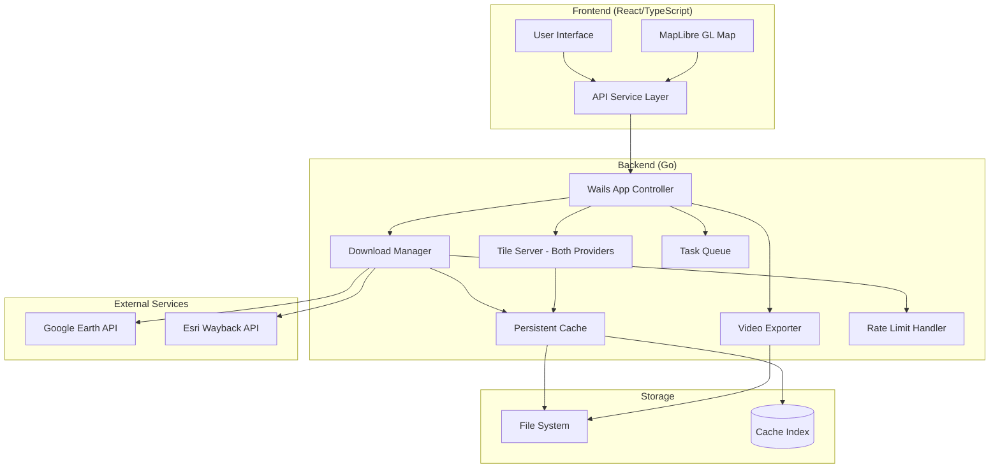
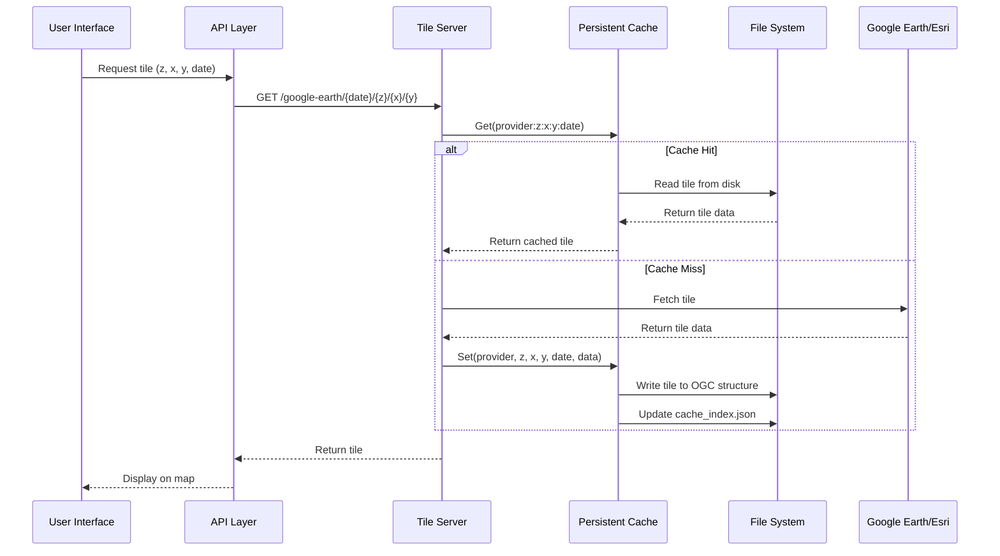
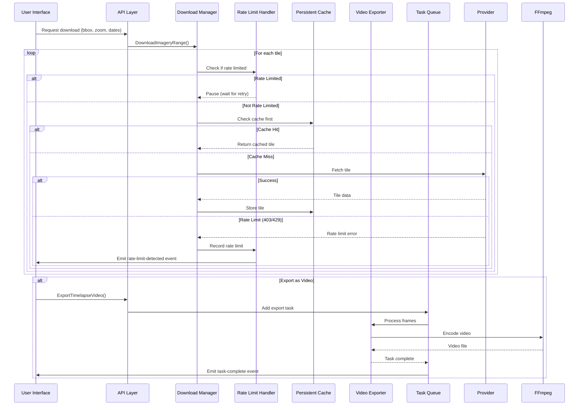
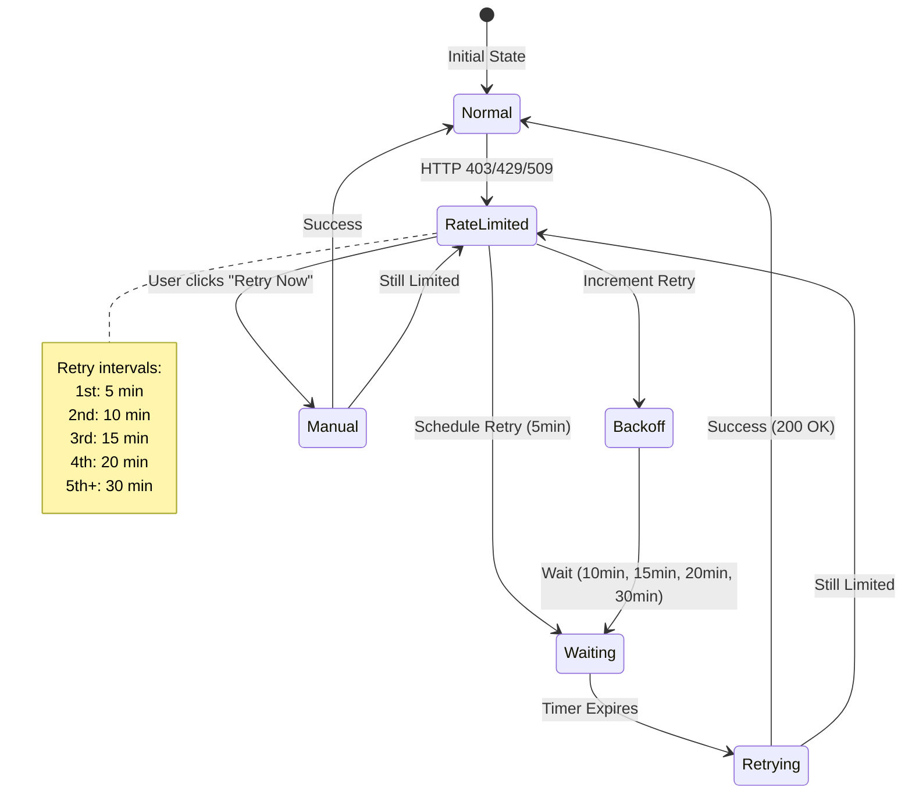

# Walkthru Earth - Imagery Desktop

A cross-platform desktop application for downloading, visualizing, and exporting satellite imagery from Google Earth and Esri Wayback archives. Built with Wails v2, Go, React, and TypeScript.

## 🚀 Key Features

- **Multi-Source Imagery**: Access Google Earth historical imagery and Esri Wayback archives
- **Interactive Map Viewer**: MapLibre GL-based map with temporal slider for date selection
- **Batch Downloads**: Download imagery for custom bounding boxes with configurable zoom levels
- **Video Export**: Create timelapse videos from historical imagery sequences
- **Persistent Caching**: OGC-compliant tile cache for both Google Earth and Esri providers with cross-session persistence
- **Rate Limit Handling**: Automatic retry with exponential backoff for API rate limits
- **Security Hardening**: Coordinate validation, path traversal protection, and zoom level enforcement
- **Concurrency Control**: Semaphore-based worker pools for efficient resource management
- **Cross-Platform**: Native desktop application for macOS, Windows, and Linux

---

## 🏗️ Architecture Overview

### System Components

The application follows a modular architecture with clear separation of concerns. Both Google Earth and Esri Wayback imagery now route through a backend tile server with persistent caching, ensuring consistent performance and reduced API calls.



**Key Architecture Updates:**
- **Modular Design**: Core logic refactored from monolithic `app.go` (3,395 lines) to organized packages (~1,500 lines)
- **Unified Tile Server**: Both Google Earth and Esri tiles now route through backend server with caching
- **Security**: Path traversal protection, coordinate validation, and zoom level enforcement
- **Performance**: Semaphore-based concurrency control for optimal resource usage

### Technology Stack

**Frontend:**
- React 18 with TypeScript
- MapLibre GL for map rendering
- Tailwind CSS v4 for styling
- shadcn/ui component library
- Vite for development and bundling

**Backend:**
- Go 1.21+ for core logic
- Wails v2.11.0 for desktop framework
- FFmpeg for video encoding
- Protocol Buffers for Google Earth API

**Data Storage:**
- OGC-compliant ZXY tile cache structure
- JSON metadata index for cache management
- GeoTIFF export with GDAL-compatible structure

---

## 📊 Data Flow

### Tile Caching Flow



### Download & Export Flow



### Rate Limit Handling Flow



---

## 📁 Cache Structure (OGC-Compliant)

The application uses an OGC ZXY-compliant directory structure for tile caching, making it compatible with GeoServer, PyGeoAPI, QGIS, and GDAL. Both Google Earth and Esri Wayback tiles are cached using the same backend tile server architecture.

```
~/.walkthru-earth/imagery-desktop/cache/
├── cache_index.json              # Metadata index (LRU, TTL, sizes)
├── google_earth/                 # Google Earth provider
│   ├── 2024-12-31/               # Date as directory (OGC temporal standard)
│   │   ├── 15/                   # Zoom level 15
│   │   │   ├── 16384/            # X coordinate
│   │   │   │   └── 8192.jpg      # Y coordinate (tile)
│   │   │   └── 16385/
│   │   │       └── 8193.jpg
│   │   └── 16/
│   │       └── ...
│   └── 2020-01-01/               # Another date
│       └── 15/
│           └── ...
└── esri_wayback/                 # Esri Wayback provider
    ├── 2024-01-15/
    │   └── 15/
    │       └── ...
    └── 2023-06-30/
        └── 15/
            └── ...
```

**Cache Features:**
- ✅ Persistent across app restarts
- ✅ Unified caching for both `google_earth` and `esri_wayback` providers
- ✅ LRU eviction when exceeding size limit
- ✅ TTL-based expiration (configurable)
- ✅ Atomic metadata updates (temp file + rename)
- ✅ Automatic index rebuild if corrupted
- ✅ GDAL-accessible: `/vsicurl/file:///path/cache/{google_earth|esri_wayback}/{date}/{z}/{x}/{y}.jpg`

**Default Configuration:**
- Max Size: 500 MB
- TTL: 90 days
- Location: `~/.walkthru-earth/imagery-desktop/cache/` (customizable)

---

## 🔧 Configuration

### User Settings

Settings are stored in `~/.walkthru-earth/imagery-desktop/settings/settings.json`:

```json
{
  "downloadPath": "~/Downloads/imagery",
  "cachePath": "",
  "cacheMaxSizeMB": 500,
  "cacheTTLDays": 90,
  "autoRetryOnRateLimit": true,
  "defaultZoom": 15,
  "defaultSource": "esri",
  "downloadZoomStrategy": "fixed",
  "downloadFixedZoom": 19,
  "theme": "system"
}
```

### Wails Configuration

Project configuration is in [wails.json](wails.json). Key settings:

- **Frontend**: Vite dev server on port 5173
- **Backend**: Go 1.21+
- **Build**: Native binaries for macOS (Universal), Windows (AMD64), Linux (AMD64)

---

## 🛠️ Development

### Prerequisites

- Go 1.21 or later
- Node.js 18+ and npm
- Wails CLI v2.11.0+

Install Wails:
```bash
go install github.com/wailsapp/wails/v2/cmd/wails@latest
```

### Run in Development Mode

```bash
wails dev
```

The frontend dev server runs on http://localhost:5173 with Vite's fast HMR.

### Project Structure

```
.
├── app.go                    # Main application controller (Wails bindings, ~1,500 lines)
├── main.go                   # Entry point
├── frontend/
│   ├── src/
│   │   ├── App.tsx           # Main React component
│   │   ├── components/       # UI components (shadcn/ui)
│   │   ├── hooks/            # React hooks (useImageryLayer, etc.)
│   │   ├── services/         # API service layer
│   │   ├── contexts/         # React contexts (map state, etc.)
│   │   └── types/            # TypeScript type definitions
│   └── vite.config.ts        # Vite configuration
├── internal/
│   ├── cache/                # Persistent tile cache
│   ├── config/               # User settings management
│   ├── downloads/            # Download orchestration (NEW)
│   │   ├── common.go         # Shared types, validation, security
│   │   ├── esri/             # Esri download logic
│   │   └── googleearth/      # Google Earth download logic
│   ├── esri/                 # Esri Wayback API client
│   ├── googleearth/          # Google Earth API client
│   ├── handlers/             # HTTP handlers (NEW)
│   │   └── tileserver/       # Tile server for both providers
│   ├── imagery/              # Image download orchestration
│   ├── ratelimit/            # Rate limit detection & retry
│   ├── taskqueue/            # Background task management
│   ├── utils/                # Utilities (NEW)
│   │   └── naming/           # Filename and coordinate utilities
│   ├── video/                # Video export (FFmpeg)
│   └── wmts/                 # WMTS capabilities parser
├── pkg/
│   └── geotiff/              # GeoTIFF encoding
└── scripts/                  # Build scripts for all platforms
```

**Recent Refactoring:**
- `app.go` reduced from 3,395 to ~1,500 lines through modularization
- Download logic extracted to `internal/downloads/` with provider-specific packages
- Tile serving consolidated in `internal/handlers/tileserver/`
- Common utilities moved to `internal/utils/naming/`
- See [MODULARIZATION_COMPLETE.md](MODULARIZATION_COMPLETE.md) for detailed refactoring summary

---

## 🏗️ Building

### Current Platform

```bash
wails build
# or
./scripts/build.sh
```

### Cross-Platform Builds

```bash
# Build for all platforms
./scripts/build-all.sh

# Individual platforms
./scripts/build-windows.sh      # Windows AMD64
./scripts/build-linux.sh         # Linux AMD64
./scripts/build-macos-arm.sh     # macOS Apple Silicon
./scripts/build-macos-intel.sh   # macOS Intel
./scripts/build-macos-universal.sh  # macOS Universal Binary
```

Built applications will be in `build/bin/`

---

## 🎨 UI Components

This project uses [shadcn/ui](https://ui.shadcn.com/) for UI components. Pre-configured components include:

- Button, Input, Label, Card
- Select, Slider, Switch, Checkbox
- Dialog, Dropdown Menu, Tabs
- Toast notifications

Add more components:
```bash
npx shadcn@latest add [component-name]
```

---

## 📚 Documentation

### Project Documentation

- **[ARCHITECTURE.md](ARCHITECTURE.md)** - Complete system architecture, workflows, and edge cases
- **[MODULARIZATION_COMPLETE.md](MODULARIZATION_COMPLETE.md)** - Refactoring summary: app.go reduced from 3,395 to ~1,500 lines
- **[GOOGLE_EARTH_API_NOTES.md](GOOGLE_EARTH_API_NOTES.md)** - Detailed API reference for Google Earth integration
- **[RATE_LIMIT_AND_CACHE_IMPLEMENTATION.md](RATE_LIMIT_AND_CACHE_IMPLEMENTATION.md)** - Implementation details for caching and rate limiting
- **[AGENTS.md](AGENTS.md)** - Issue tracking workflow with beads (bd)

### External Resources

- [Wails Documentation](https://wails.io/docs/introduction)
- [React Documentation](https://react.dev/)
- [Vite Documentation](https://vitejs.dev/)
- [Tailwind CSS Documentation](https://tailwindcss.com/)
- [shadcn/ui Documentation](https://ui.shadcn.com/)
- [MapLibre GL Documentation](https://maplibre.org/)

---

## ⚠️ Educational Purpose & Legal

This project is created for educational purposes only and is provided as-is, without any warranty.

### Software License

The software code in this repository is licensed under the [Creative Commons Attribution 4.0 International License (CC BY 4.0)](LICENSE). You are free to share and adapt the code with proper attribution to Walkthru Earth (hi@walkthru.earth).

### Imagery Copyright

**IMPORTANT**: The satellite imagery accessed through this application remains the property of the respective providers:

- **Esri Wayback Imagery**: © Esri and its data providers. All rights reserved.
- **Google Earth Imagery**: © Google and its data providers. All rights reserved.

This software does not grant any rights to the satellite imagery itself. Users are responsible for complying with the terms of service and licensing requirements of Esri and Google when using their imagery. Any use of the imagery is subject to the providers' terms and conditions, and users assume all responsibility and liability for their use of the imagery.

---

## 🤝 Contributing

This is an educational project. For feature requests or bug reports, please refer to the documentation in the repository.

---

**Built with ❤️ by Walkthru Earth** | [hi@walkthru.earth](mailto:hi@walkthru.earth)
