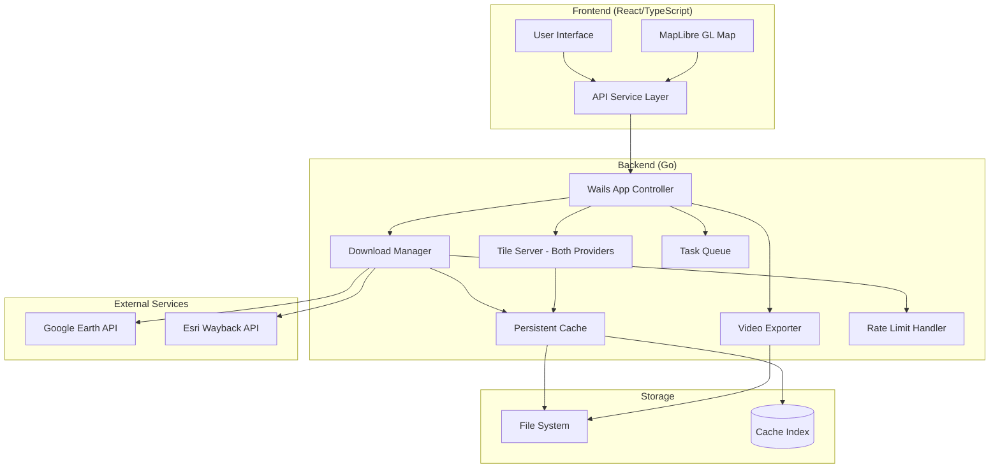
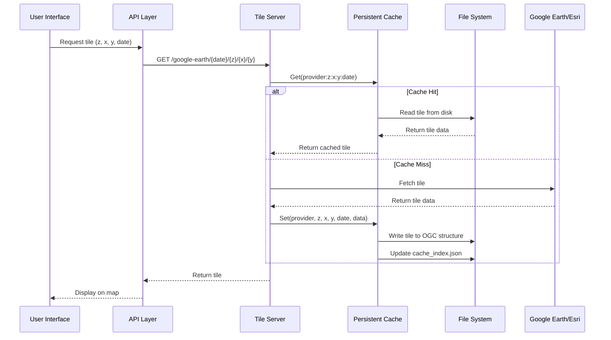
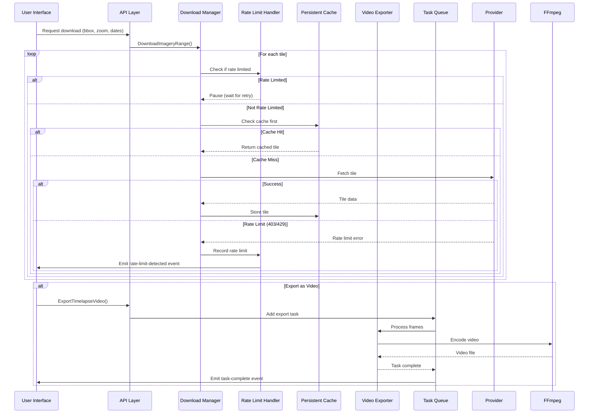
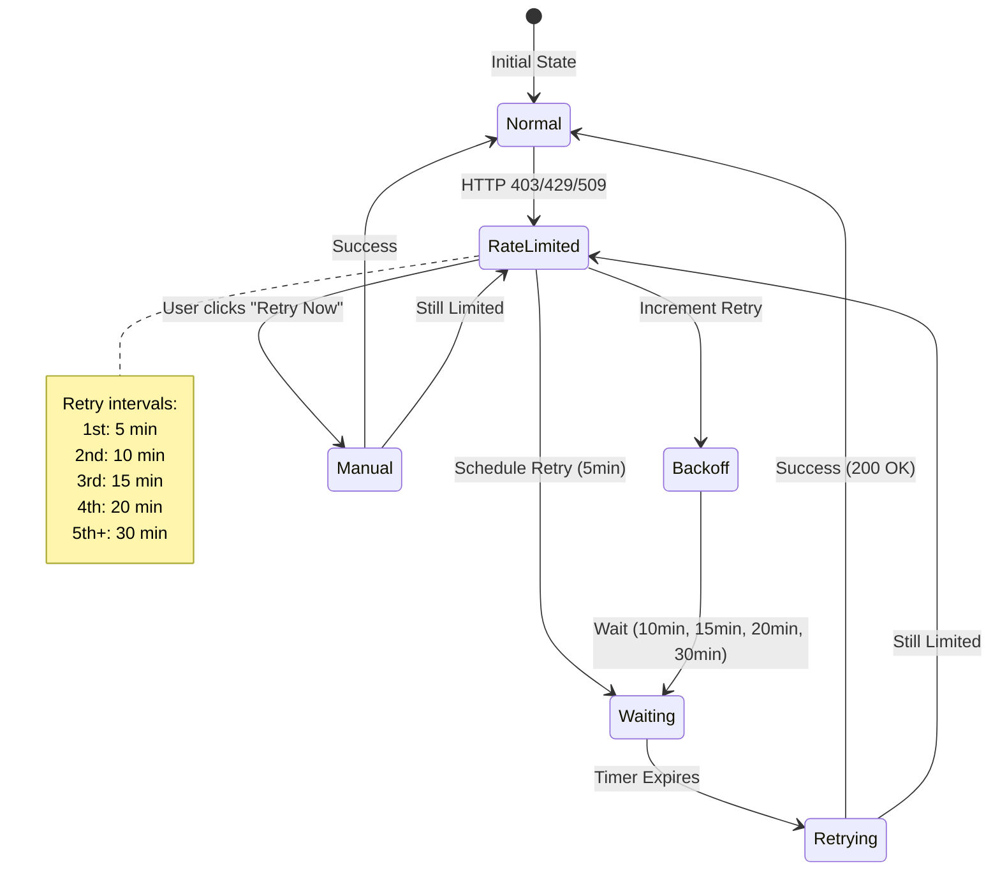

# Walkthru Earth - Imagery Desktop

A cross-platform desktop application for downloading, visualizing, and exporting satellite imagery from Google Earth and Esri Wayback archives.

## Features

- **Multi-Source Imagery** - Access Google Earth historical imagery and Esri Wayback archives
- **Interactive Map** - MapLibre GL-based viewer with temporal slider for date selection
- **Batch Downloads** - Download imagery for custom bounding boxes with configurable zoom levels
- **Video Export** - Create timelapse videos from historical imagery sequences
- **Persistent Cache** - OGC-compliant tile cache with cross-session persistence
- **Cross-Platform** - Native desktop application for macOS, Windows, and Linux

## Architecture



## Technology Stack

| Layer | Technologies |
|-------|-------------|
| Frontend | React 18, TypeScript, MapLibre GL, Tailwind CSS v4, shadcn/ui, Vite |
| Backend | Go 1.21+, Wails v2.11, FFmpeg, Protocol Buffers |
| Storage | OGC ZXY tile cache, JSON metadata, GeoTIFF export |

## Data Flow

### Tile Caching



### Download & Export



### Rate Limit Handling



## Cache Structure

OGC ZXY-compliant directory structure compatible with GeoServer, QGIS, and GDAL:

```
~/.walkthru-earth/imagery-desktop/cache/
├── cache_index.json              # Metadata index (LRU, TTL, sizes)
├── google_earth/
│   └── {date}/                   # e.g., 2024-12-31
│       └── {z}/{x}/{y}.jpg       # OGC ZXY structure
└── esri_wayback/
    └── {date}/
        └── {z}/{x}/{y}.jpg
```

| Feature | Value |
|---------|-------|
| Max Size | 500 MB (configurable) |
| TTL | 90 days (configurable) |
| Eviction | LRU when exceeding size limit |
| Persistence | Survives app restarts |

## Installation

Download the latest release from [walkthru.earth/software/imagery-desktop](https://walkthru.earth/software/imagery-desktop).

### macOS

The app is not signed with an Apple Developer certificate. After downloading:

```bash
# Remove quarantine attribute
xattr -cr /path/to/imagery-desktop.app

# Or if you moved it to Applications:
xattr -cr /Applications/imagery-desktop.app
```

If you see "damaged and can't be opened", this command will fix it.

### Windows

Windows SmartScreen may show "Windows protected your PC". Click **More info** → **Run anyway**.

## Development

### Prerequisites

- Go 1.21+
- Node.js 18+
- Wails CLI v2.11.0+

```bash
go install github.com/wailsapp/wails/v2/cmd/wails@latest
```

### Run

```bash
wails dev
```

### Build

```bash
# Current platform
wails build

# All platforms
./scripts/build-all.sh
```

## Configuration

Settings stored in `~/.walkthru-earth/imagery-desktop/settings/settings.json`:

| Setting | Default | Description |
|---------|---------|-------------|
| `downloadPath` | `~/Downloads/imagery` | Where downloads are saved |
| `cacheMaxSizeMB` | `500` | Maximum cache size |
| `cacheTTLDays` | `90` | Cache expiration |
| `defaultZoom` | `15` | Default map zoom level |
| `defaultSource` | `esri` | Default imagery source |

## Project Structure

```
├── app.go                    # Main Wails app controller
├── main.go                   # Entry point
├── frontend/
│   └── src/
│       ├── components/       # UI components (shadcn/ui)
│       ├── hooks/            # React hooks
│       ├── services/         # API service layer
│       └── contexts/         # React contexts
├── internal/
│   ├── cache/                # Persistent tile cache
│   ├── downloads/            # Download orchestration
│   │   ├── esri/             # Esri downloader
│   │   └── googleearth/      # Google Earth downloader
│   ├── handlers/tileserver/  # Unified tile server
│   ├── ratelimit/            # Rate limit handling
│   ├── taskqueue/            # Background tasks
│   └── video/                # Video export
└── pkg/geotiff/              # GeoTIFF encoding
```

## Documentation

- [ARCHITECTURE.md](docs/ARCHITECTURE.md) - Detailed system architecture and edge cases
- [GOOGLE_EARTH_API_NOTES.md](docs/GOOGLE_EARTH_API_NOTES.md) - Google Earth API reference (Flatfile & RT/Earth APIs)
- [EPOCH_FIX_SUMMARY.md](docs/EPOCH_FIX_SUMMARY.md) - Historical imagery epoch handling

## Legal Notice

This project is for **educational purposes only**.

### Software License

The code is licensed under [CC BY 4.0](LICENSE). You may share and adapt with attribution to Walkthru Earth.

### Imagery Copyright

Satellite imagery remains property of the respective providers:
- **Esri Wayback** - © Esri and its data providers
- **Google Earth** - © Google and its data providers

Users are responsible for complying with provider terms of service.

---

**Walkthru Earth** | [hi@walkthru.earth](mailto:hi@walkthru.earth)
